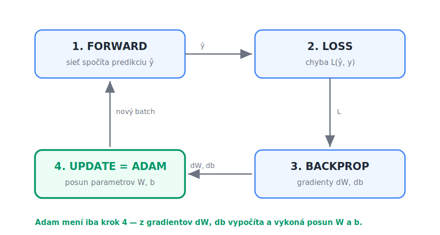

# Adam — kompletná špecifikácia optimalizátora pre feed-forward sieť

Tento dokument popisuje algoritmus **Adam** (Adaptive Moment Estimation) tak podrobne, aby
podľa neho študent vedel naprogramovať proces učenia doprednej (feed-forward) neurónovej
siete — bez použitia hotového frameworku.

---

## 0. Anatómia feed-forward siete — kde sú váhy, bias a aktivačná funkcia

Než sa pustíme do optimalizátora, treba vedieť, **čo vlastne Adam upravuje**. Nasledujúci
obrázok ukazuje jednoduchú doprednú sieť s troma vrstvami. Signál tečie zľava doprava
(preto „feed-forward"): vstupy → skrytá vrstva → výstupy.


Medzi každými dvoma susednými vrstvami je jedna **váhová matica `W`** a jeden **vektor
biasov `b`** (na obrázku `W₁, b₁` medzi vstupom a skrytou vrstvou, `W₂, b₂` medzi skrytou
a výstupnou). Vnútri každého neurónu (okrem vstupných) sa navyše aplikuje **aktivačná
funkcia `σ`**. Práve `W` a `b` sú **učené parametre** — to sú tie, ktoré Adam v každom kroku
posúva. Aktivačná funkcia `σ` je pevne daná a nemení sa.

### Čo sa deje v jednom neuróne

Aby bolo jasné, kde presne váhy, bias a aktivácia vstupujú do výpočtu, priblížme si jeden
neurón:


Neurón robí dva kroky:

1. **Vážený súčet + bias** — každý vstup `xᵢ` sa vynásobí svojou **váhou `wᵢ`**, sčíta sa
   a pripočíta sa **bias `b`**:  `z = w₁x₁ + w₂x₂ + … + b`  (skrátene `z = w·x + b`).
2. **Aktivácia** — na `z` sa aplikuje **aktivačná funkcia `σ`** (napr. ReLU, sigmoid, tanh),
   ktorá dá výstup neurónu `a = σ(z)`. Aktivácia vnáša do siete nelinearitu — bez nej by
   celá sieť bola len jedna lineárna funkcia.

Zhrnutie mapovania na algoritmus nižšie:

| Prvok na obrázku | Symbol | Učený parameter? | Adam ho upravuje? |
|---|---|---|---|
| váhy | `W` (`wᵢ`) | áno | **áno** |
| bias | `b` | áno | **áno** |
| aktivačná funkcia | `σ` | nie (pevná voľba) | nie |

Adam teda pracuje s gradientmi `dW` a `db` (parciálne derivácie chyby podľa `W` a `b`) —
presne s tými, ktoré vypadnú z backpropu.

---

## 1. Kontext: kde sa Adam nachádza v tréningovej slučke

Tréning siete je opakovanie štyroch krokov nad mini-batchmi dát:

1. **Forward** — sieť spočíta predikciu `ŷ` pre vstupný batch.
2. **Loss** — chybová funkcia (napr. cross-entropy) porovná `ŷ` so skutočnosťou `y`.
3. **Backward (backprop)** — spätným šírením sa spočítajú **gradienty** chyby podľa každého
   parametra: `dW` pre každú váhovú maticu, `db` pre každý bias.
4. **Update** — parametre sa posunú proti smeru gradientu. **Toto je práca optimalizátora.**

Obyčajný gradient descent (SGD) robí update takto:

```
W ← W − lr · dW
b ← b − lr · db
```

**Adam nahrádza iba krok 4.** Forward, loss aj backprop ostávajú nezmenené — Adam pracuje
s presne tými istými gradientmi `dW`, `db`, ktoré už z backpropu máte. Mení len *spôsob*,
akým sa z gradientu vypočíta krok.



Slučka beží dokola nad jednotlivými mini-batchmi. Adam sedí **iba v kroku 4 (update)** —
dostane gradienty `dW`, `db` z backpropu (krok 3) a rozhodne, ako veľmi a ktorým smerom
posunúť `W` a `b`. Ostatné tri kroky sú od optimalizátora nezávislé.

---

## 2. Idea: prečo Adam funguje lepšie ako SGD

Adam kombinuje dve myšlienky:

- **Momentum (1. moment `m`)** — namiesto surového gradientu použije jeho **kĺzavý priemer**.
  To vyhladí šum medzi batchmi a dá updatu „zotrvačnosť", takže prejde ploché plató a plytké
  jamky.
- **Adaptívny krok (2. moment `v`)** — sleduje kĺzavý priemer **druhých mocnín** gradientu,
  čiže „ako veľké gradienty daný parameter mával". Krok pre každý parameter sa vydelí
  odmocninou tejto hodnoty:
  - parameter s **veľkými** gradientmi → menší, opatrnejší krok,
  - parameter s **malými** gradientmi → väčší krok.

Výsledok: **každý parameter má vlastnú, automaticky prispôsobenú rýchlosť učenia**, a tréning
je menej citlivý na voľbu `lr` než čisté SGD.

---

## 3. Matematické základy — ako to celé funguje

Táto časť vysvetľuje matematiku za algoritmom. Nie je nutná na to, aby ste Adam
naprogramovali, ale je nutná na to, aby ste rozumeli, *prečo* vzorce vyzerajú tak, ako vyzerajú.

### 3.1 Cieľ: minimalizácia chybovej funkcie

Tréning je **optimalizačná úloha**. Máme chybovú (loss) funkciu `L(θ)`, ktorá závisí od
všetkých parametrov siete `θ = (W1, b1, W2, b2, …)`, a hľadáme také `θ`, pre ktoré je `L`
čo najmenšie.

**Gradient** `∇L(θ) = ∂L/∂θ` je vektor parciálnych derivácií — ukazuje smer **najstrmšieho
rastu** `L`. Preto ideme **proti** nemu:

```
θ ← θ − α · ∇L(θ)
```

To je gradient descent. Backprop nie je nič iné než efektívny výpočet `∇L(θ)` cez reťazové
pravidlo. Celý zvyšok je otázka: **ako dobre zvoliť veľkosť a smer kroku** z tohto gradientu.

### 3.2 Problém surového gradientu

Gradient z jedného mini-batchu je len **hlučný odhad** skutočného gradientu (počítame ho
z malej vzorky dát, nie z celého datasetu). To má dva dôsledky:

- **Šum** — smer skáče od batchu k batchu, update „kľučkuje".
- **Rôzne mierky** — niektoré parametre majú trvalo veľké gradienty, iné maličké. Jedno
  spoločné `α` je preto vždy kompromis: pre jedny parametre priveľké, pre druhé primalé.

Adam rieši oboje pomocou **exponenciálne kĺzavých priemerov (EMA)**.

### 3.3 Exponenciálne kĺzavý priemer (EMA)

EMA je spôsob, ako priebežne odhadovať priemer postupnosti hodnôt `g₁, g₂, g₃, …` bez toho,
aby sme si ich všetky pamätali:

```
mₜ = β · mₜ₋₁ + (1 − β) · gₜ
```

Rozpísaním rekurzie vidno, čo to naozaj počíta:

```
mₜ = (1 − β) · ( gₜ + β·gₜ₋₁ + β²·gₜ₋₂ + β³·gₜ₋₃ + … )
```

Je to teda **vážený priemer minulých hodnôt**, kde staršie príspevky exponenciálne miznú
(váha `βᵏ`). Čím je `β` bližšie k 1, tým „dlhšiu pamäť" má priemer a tým je hladší.
Zhruba priemeruje cez posledných `≈ 1/(1−β)` hodnôt:

- `β1 = 0.9` → priemer cez ~10 posledných gradientov (1. moment),
- `β2 = 0.999` → priemer cez ~1000 posledných hodnôt (2. moment).

### 3.4 Prvý moment `m` — vyhladený smer (momentum)

`m` je EMA samotného gradientu:

```
mₜ = β1 · mₜ₋₁ + (1 − β1) · gₜ
```

Je to **odhad strednej hodnoty** gradientu, `m ≈ E[g]`. Priemerovaním sa náhodný šum medzi
batchmi vyruší a ostane skutočný, konzistentný smer klesania. Fyzikálna analógia: gulička,
ktorá sa kotúľa dolu svahom a má **zotrvačnosť** — prejde ploché miesta aj plytké jamky
namiesto toho, aby v každom bode reagovala len na okamžitý sklon.

### 3.5 Druhý moment `v` — mierka gradientu

`v` je EMA **druhých mocnín** gradientu (po prvkoch):

```
vₜ = β2 · vₜ₋₁ + (1 − β2) · gₜ²
```

Je to **odhad `E[g²]`**, teda typická *veľkosť* gradientu daného parametra (nezáleží na
znamienku). `√v` má rozmer gradientu a hovorí „ako veľké kroky tento parameter zvyčajne
robí". Poznámka: `E[g²] = Var(g) + (E[g])²`, čiže `v` v sebe nesie aj informáciu o rozptyle
(neistote) gradientu.

### 3.6 Spojenie: update s adaptívnym krokom

Finálny update delí vyhladený smer typickou veľkosťou:

```
θ ← θ − α · m̂ / (√v̂ + ε)
```

Podiel `m̂ / √v̂` je bezrozmerný — je to niečo ako **„signál k šumu"** (SNR) daného parametra:

- Ak parameter dlhodobo ťahá jedným smerom (`|m|` veľké oproti `√v`) → podiel ≈ 1 → plný krok.
- Ak sa gradient len chaoticky knísa okolo nuly (`|m|` malé oproti `√v`) → podiel ≈ 0 →
  krok sa utlmí.

Preto **každý parameter dostane vlastnú, automaticky prispôsobenú rýchlosť učenia** a `α` len
škáluje celkovú veľkosť kroku (jeho voľba je oveľa menej citlivá než pri čistom SGD).
`ε` je len poistka proti deleniu nulou v miestach, kde je `√v̂` takmer nula.

### 3.7 Prečo bias correction — odvodenie

`m` a `v` inicializujeme na nuly. Nula ale nie je neutrálny štart — je to hodnota, ktorá
priemer **ťahá nadol**, kým sa „nerozbehne". Pozrime sa, ako veľmi. Ak by boli gradienty
zhruba stacionárne s priemerom `E[g]`, dá sa ukázať:

```
E[mₜ] = (1 − β1ᵗ) · E[gₜ]
```

Faktor `(1 − β1ᵗ)` je na začiatku výrazne menší než 1 (pre `t=1` je to len `1 − β1 = 0.1`),
takže `mₜ` skutočnú hodnotu **podhodnocuje**. Delením práve týmto faktorom skreslenie presne
odstránime:

```
m̂ₜ = mₜ / (1 − β1ᵗ)        (analogicky  v̂ₜ = vₜ / (1 − β2ᵗ))
```

Pre veľké `t` platí `βᵗ → 0`, takže `(1 − βᵗ) → 1` a korekcia sa prirodzene vytráca —
ovplyvňuje len prvé kroky. To je aj dôvod, prečo `t` musí začínať od **1**: pre `t=0` by bol
menovateľ `1 − β⁰ = 0`.

### 3.8 Zhrnutie matematiky

Adam v každom kroku odhaduje dva štatistické momenty gradientu — **priemer** (`m`, smer)
a **druhý moment** (`v`, mierku) — pomocou exponenciálne kĺzavých priemerov, opraví ich
rozbehové skreslenie a urobí krok v smere priemeru, škálovaný inverznou veľkosťou gradientu.
Tým spája **momentum** (hladký smer) a **adaptívny learning rate per parameter** do jedného
pravidla.

---

## 4. Hyperparametre

| Symbol | Význam | Odporúčaná hodnota |
|---|---|---|
| `lr` (α) | rýchlosť učenia (learning rate) | `0.001` |
| `β1` | koeficient vyhladzovania 1. momentu | `0.9` |
| `β2` | koeficient vyhladzovania 2. momentu | `0.999` |
| `ε` (epsilon) | malé číslo proti deleniu nulou | `1e-8` |

Tieto hodnoty sú štandardné a fungujú takmer vždy — začnite s nimi.

---

## 5. Stavové premenné

Adam si musí **medzi krokmi pamätať stav** pre **každý** parameter siete. Pre každú váhovú
maticu `W` a každý bias `b` si drží:

- `m` — 1. moment (kĺzavý priemer gradientu), **rovnaký tvar ako parameter**,
- `v` — 2. moment (kĺzavý priemer druhých mocnín gradientu), **rovnaký tvar ako parameter**.

Navyše jeden spoločný čítač:

- `t` — poradové číslo kroku (počet doteraz vykonaných updateov), celé číslo.

**Inicializácia (pred tréningom):**

```
pre každý parameter P (každé W, každé b):
    m_P = pole núl s rovnakým tvarom ako P
    v_P = pole núl s rovnakým tvarom ako P
t = 0
```

> Pozor: `m` a `v` **nie sú zdieľané** medzi parametrami. Ak má sieť vrstvy s `W1, b1, W2, b2, …`,
> každý z nich má vlastné `m` a `v`.

---

## 6. Algoritmus jedného update kroku

Vykonáva sa **raz za mini-batch**, po backprope, pre **každý** parameter zvlášť (`P` je
parameter, `g` je jeho gradient z backpropu, napr. `P = W`, `g = dW`):

```
t ← t + 1                              # zvýš čítač krokov (raz za batch, spoločné)

# --- pre každý parameter P s gradientom g: ---

m ← β1 · m + (1 − β1) · g              # aktualizuj 1. moment (po prvkoch)
v ← β2 · v + (1 − β2) · (g ⊙ g)        # aktualizuj 2. moment (g² po prvkoch)

m̂ ← m / (1 − β1^t)                     # bias correction 1. momentu
v̂ ← v / (1 − β2^t)                     # bias correction 2. momentu

P ← P − lr · m̂ / (sqrt(v̂) + ε)         # samotný update parametra (po prvkoch)
```

Všetky operácie (`⊙`, `sqrt`, delenie) sú **po prvkoch** (element-wise) — `m`, `v`, `g` aj `P`
majú rovnaký tvar.

### Prečo bias correction (`m̂`, `v̂`)?

Na začiatku sú `m` aj `v` inicializované na nuly, takže prvých pár krokov sú **podhodnotené**
(ťahané k nule). Delenie výrazom `(1 − β^t)` túto podhodnotenosť koriguje. Keďže `β2 = 0.999`,
`β2^t` klesá pomaly — bez korekcie by boli prvé kroky výrazne skreslené. Pre veľké `t` sa
`1 − β^t` blíži k 1 a korekcia prestáva mať vplyv.

> Časté hľadanie chyby: `t` musí začínať od **1** v prvom kroku (preto `t ← t + 1` na začiatku),
> inak by `1 − β^0 = 0` a delili by ste nulou.

---

## 7. Referenčná implementácia (NumPy)

Ilustračná, samostatná trieda. `params` je zoznam parametrov, `grads` zoznam ich gradientov
v **rovnakom poradí** (napr. `[W1, b1, W2, b2]` a `[dW1, db1, dW2, db2]`).

```python
import numpy as np

class Adam:
    def __init__(self, params, lr=0.001, beta1=0.9, beta2=0.999, eps=1e-8):
        self.lr = lr
        self.beta1 = beta1
        self.beta2 = beta2
        self.eps = eps
        self.t = 0
        # vlastné m a v pre každý parameter, inicializované na nuly
        self.m = [np.zeros_like(p) for p in params]
        self.v = [np.zeros_like(p) for p in params]

    def step(self, params, grads):
        """Vykoná jeden update krok. Mení params na mieste (in-place)."""
        self.t += 1
        for i, (p, g) in enumerate(zip(params, grads)):
            # 1. a 2. moment (po prvkoch)
            self.m[i] = self.beta1 * self.m[i] + (1 - self.beta1) * g
            self.v[i] = self.beta2 * self.v[i] + (1 - self.beta2) * (g * g)

            # bias correction
            m_hat = self.m[i] / (1 - self.beta1 ** self.t)
            v_hat = self.v[i] / (1 - self.beta2 ** self.t)

            # update parametra (in-place, aby sa zmena prejavila v sieti)
            p -= self.lr * m_hat / (np.sqrt(v_hat) + self.eps)
```

### Použitie v tréningovej slučke

```python
opt = Adam(params=[W1, b1, W2, b2], lr=0.001)

for epoch in range(num_epochs):
    for X_batch, y_batch in batches(X_train, y_train, batch_size=64):
        y_hat = forward(X_batch)                 # 1. forward
        loss  = cross_entropy(y_hat, y_batch)    # 2. loss
        dW1, db1, dW2, db2 = backward(...)        # 3. backprop
        opt.step([W1, b1, W2, b2],
                 [dW1, db1, dW2, db2])            # 4. update (Adam)
```

> Dôležité: `p -= ...` mení pole **na mieste**. Ak vo vašej sieti nie sú parametre uložené
> ako meniteľné NumPy polia zdieľané s tréningom, upravte tak, aby `step` vracal nové hodnoty
> a vy si ich uložili späť do siete.

---

## 8. Kontrola správnosti

Ako si overiť, že je Adam implementovaný dobre:

1. **Klesajúci loss** — na MNIST má loss v prvých epochách zreteľne klesať a presnosť rásť.
2. **Rýchlejšia konvergencia než SGD** — pri rovnakom `lr` (alebo aj menšom) by mal Adam
   dosiahnuť nižší loss za menej epôch. Vykreslite si obe krivky do jedného grafu.
3. **Stabilita** — ak loss „vybuchne" (NaN), skontrolujte:
   - či nedelíte nulou (chýbajúce `+ ε` alebo `t` začína od 0),
   - či `m`, `v` majú správny tvar a nie sú náhodou zdieľané medzi parametrami,
   - či je `lr` primeraný (skúste `0.001`).
4. **Sanity check na malom probléme** — najprv otestujte na jednoduchej úlohe (napr. XOR alebo
   aproximácia funkcie), kde rýchlo vidno, či sieť konverguje.

---

## 9. Zhrnutie v jednej vete

Adam = SGD, v ktorom namiesto surového gradientu použijete jeho **vyhladený priemer** (`m`),
podelený **typickou veľkosťou gradientu** daného parametra (`sqrt(v)`), s **korekciou
rozbehu** (`m̂`, `v̂`) — čím každý parameter dostane vlastnú adaptívnu rýchlosť učenia.
