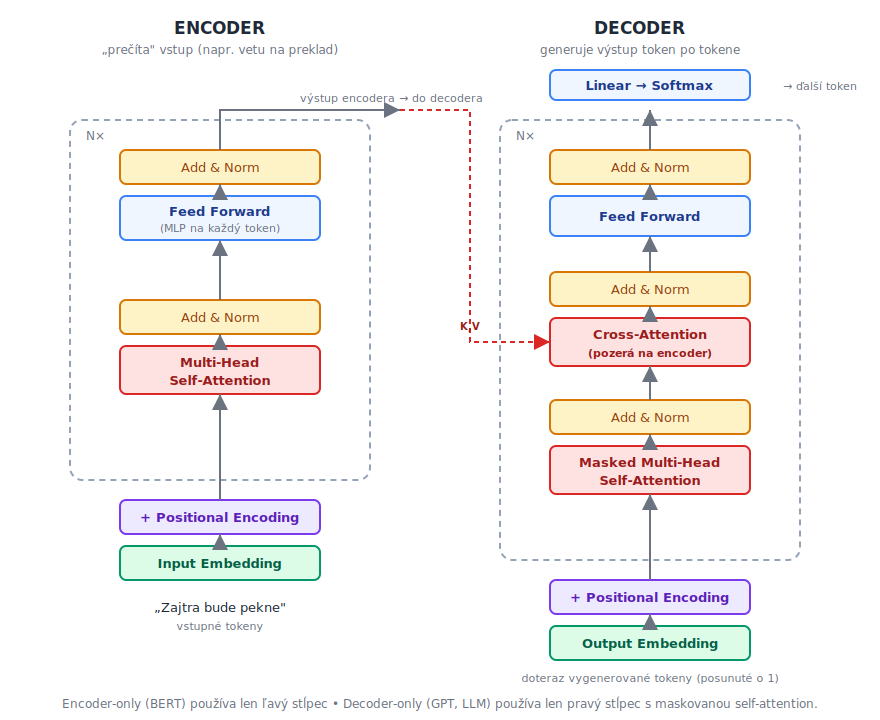
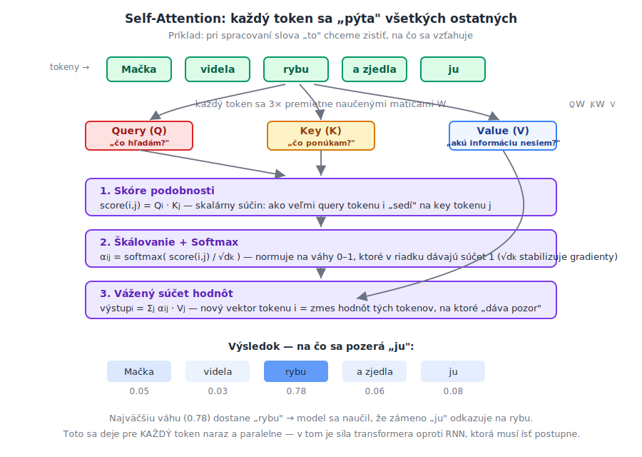
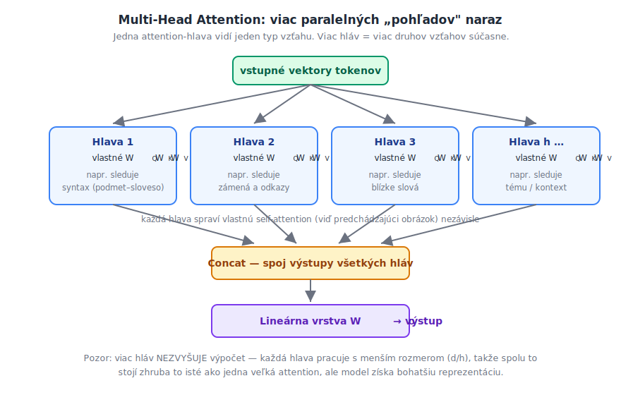
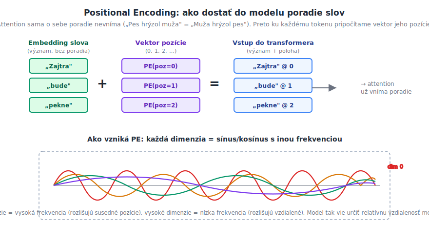

# Transformery — ako fungujú (detailne, s obrázkami)

> **Cieľ dokumentu:** vysvetliť krok po kroku, ako funguje **transformer** — architektúra, ktorá stojí za dnešnými veľkými jazykovými modelmi (GPT, Claude, BERT…), prekladačmi aj generovaním obrázkov. Ťažiskom sú **detailné obrázky** mechanizmu **attention**, pretože práve on je jadrom celej myšlienky.

Tento text nadväzuje na všeobecný [prehľad AI a modelov](umela-inteligencia-prehlad.md) a na dokument o [embeddingoch](embeddings.md) (ako sa z textu stanú vektory — to je vstup do transformera).

---

## Prečo vôbec transformer

Pred rokom 2017 sa text a postupnosti spracovávali hlavne **rekurentnými sieťami (RNN, LSTM)**. Tie čítali vetu **slovo po slove**, zľava doprava, a niesli si so sebou „pamäť". Mali dva zásadné problémy:

1. **Sekvenčnosť** — token č. 100 sa nedal spracovať, kým nebol hotový token č. 99. Nedalo sa to poriadne paralelizovať, teda ani rýchlo trénovať na GPU.
2. **Krátka pamäť** — informácia zo začiatku dlhej vety sa cestou „rozriedila", model zabúdal vzdialený kontext.

Článok *„Attention Is All You Need"* (2017) navrhol architektúru **transformer**, ktorá obe veci rieši jedným ťahom: zahodí rekurenciu a nahradí ju **mechanizmom attention**, ktorý dovolí každému tokenu **priamo sa pozrieť na všetky ostatné naraz**. Tým sa spracovanie dá plne paralelizovať a vzdialený kontext je rovnako dostupný ako blízky.

> **Kľúčová veta na zapamätanie:** transformer nahradil „čítanie po jednom slove" za „pozretie na všetky slová naraz a rozhodnutie, ktoré sú teraz dôležité".

---

## Celková architektúra

Pôvodný transformer má dve časti — **encoder** (prečíta a pochopí vstup) a **decoder** (generuje výstup). Nižšie je celková schéma; jednotlivé bloky rozoberieme v ďalších sekciách.



Čítajme to **zdola nahor**:

1. **Vstup → tokeny → embeddingy.** Text sa rozseká na tokeny a každý sa premení na vektor (viď [embeddings.md](embeddings.md)).
2. **+ Positional encoding.** Ku každému embeddingu sa pripočíta informácia o **pozícii** tokenu vo vete (o tom nižšie).
3. **Encoder blok (N-krát za sebou):** *Multi-Head Self-Attention* → *Add & Norm* → *Feed Forward* → *Add & Norm*. Každý token si po ceste „nazbiera" kontext z ostatných.
4. **Decoder blok (N-krát):** navyše obsahuje **maskovanú** self-attention (pozerá len dozadu, nie do budúcnosti) a **cross-attention** (pozerá na výstup encodera).
5. **Linear → Softmax.** Z posledného vektora sa vyrobí pravdepodobnosť ďalšieho tokenu.

Dnešné modely často používajú len **jednu z častí**:

| Variant | Používa | Príklady | Na čo |
|---|---|---|---|
| **Encoder-only** | len ľavý stĺpec | BERT, embedding modely | pochopenie textu, klasifikácia, [embeddingy](embeddings.md) |
| **Decoder-only** | len pravý stĺpec (s maskou) | GPT, Claude, Llama | **generovanie textu** — dnešné LLM |
| **Encoder-decoder** | obe časti | T5, prekladače | preklad, sumarizácia (vstup → iný výstup) |

Dva stavebné prvky, ktoré sa opakujú v každom bloku:

- **Add & Norm** — *reziduálne spojenie* (k výstupu vrstvy sa pripočíta jej vstup) + normalizácia. Umožňuje trénovať veľmi hlboké siete bez toho, aby sa gradient „stratil".
- **Feed Forward** — obyčajný [MLP](umela-inteligencia-prehlad.md#3-feed-forward-neurónové-siete-mlp) aplikovaný na každý token zvlášť; tu si model „premyslí" informáciu nazbieranú attention.

Zvyšok dokumentu sa venuje srdcu celej veci — **attention**.

---

## Attention krok po kroku (Query, Key, Value)

Predstavme si, že model spracúva vetu a pri každom slove sa pýta: *„ktoré iné slová v tejto vete sú teraz pre mňa dôležité?"* Presne toto robí **self-attention**.

Mechanizmus pracuje s tromi rolami, ktoré si každý token vyrobí zo svojho vektora (vynásobením troma naučenými maticami W_Q, W_K, W_V):

- **Query (Q)** — *„čo hľadám?"* (otázka tokenu)
- **Key (K)** — *„čo ponúkam / čím sa dám nájsť?"* (nálepka tokenu)
- **Value (V)** — *„akú informáciu nesiem?"* (obsah tokenu)

Analógia s vyhľadávaním: **Query** je to, čo napíšeš do vyhľadávača, **Key** sú kľúčové slová stránok a **Value** je samotný obsah stránky, ktorý dostaneš, keď sa Query s Key zhodujú.



Výpočet má tri kroky (na obrázku očíslované):

1. **Skóre podobnosti.** Pre token *i* spočítame skalárny súčin jeho **Query** s **Key** každého tokenu *j*: `score(i,j) = Qᵢ · Kⱼ`. Veľké skóre = „tieto dva tokeny spolu súvisia".
2. **Škálovanie + softmax.** Skóre vydelíme `√dₖ` (stabilizácia gradientov pri veľkých rozmeroch) a prevedieme cez **softmax** — dostaneme **váhy pozornosti** `αᵢⱼ` medzi 0 a 1, ktoré v riadku dávajú súčet 1.
3. **Vážený súčet hodnôt.** Nový vektor tokenu *i* je vážený priemer **Value** vektorov: `výstupᵢ = Σⱼ αᵢⱼ · Vⱼ`. Token teda do seba „natiahne" obsah tých tokenov, na ktoré dáva najväčšiu pozornosť.

V príklade na obrázku pri spracovaní zámena **„ju"** dostane najväčšiu váhu (0.78) slovo **„rybu"** — model sa naučil, že zámeno odkazuje práve naň. Toto rozhodnutie **nie je naprogramované**; vyplynulo z tréningu z obrovského množstva textu.

> **Prečo je to lepšie než RNN:** tento výpočet sa deje pre **všetky tokeny naraz a paralelne** (je to v podstate násobenie matíc), a každý token má **priamy prístup** ku každému inému — aj tomu na opačnom konci vety. Odtiaľ paralelizovateľnosť aj dlhá pamäť.

### Maskovaná attention (v decoderi)

Pri **generovaní** textu model produkuje token po tokene a nesmie „podvádzať" tým, že by videl budúce slová. Preto sa v decoderi použije **maska**: skóre pre všetky pozície *napravo* od aktuálnej sa nastaví na `−∞`, takže po softmaxe dostanú váhu 0. Token tak vidí len seba a to, čo bolo pred ním.

### Cross-attention (encoder ↔ decoder)

V encoder-decoder modeloch (napr. preklad) berie **cross-attention** vrstva **Query z decodera**, ale **Key a Value z encodera**. Znamená to: *„pri generovaní ďalšieho slova prekladu sa pozri, ktoré slová pôvodnej vety sú teraz relevantné."*

---

## Multi-Head Attention — viac pohľadov naraz

Jedna attention „hlava" zachytí **jeden typ vzťahu** (napr. gramatickú zhodu). To by bolo málo — vo vete existuje naraz viacero druhov vzťahov (syntax, odkazy zámen, téma…). Riešením je púšťať **viac attention hláv paralelne**, každú s vlastnými maticami W_Q, W_K, W_V.



Postup:

1. Vstup sa rozdelí do **h hláv** (napr. 8, 12, 96…). Každá hlava pracuje v menšom rozmere `d/h`.
2. Každá hlava spraví **vlastnú self-attention** (presne tú z predchádzajúcej sekcie) — a keďže má vlastné váhy, naučí sa sledovať iný typ vzťahu.
3. Výstupy všetkých hláv sa **spoja (concat)** a prejdú cez výstupnú lineárnu vrstvu `W_O`.

**Dôležité:** viac hláv **nezvyšuje** výpočtovú náročnosť dramaticky — každá hlava pracuje s menším rozmerom, takže spolu to stojí zhruba ako jedna veľká attention, ale model získa **oveľa bohatšiu reprezentáciu**. Rôzne hlavy sa reálne špecializujú — pri vizualizácii vidno hlavy, ktoré párujú sloveso s podmetom, iné zas zátvorky či zámená.

---

## Positional Encoding — kde je informácia o poradí

Attention má jednu „slepú škvrnu": sama o sebe **nevníma poradie** slov. Pre attention je množina tokenov len... množina — „Pes hrýzol muža" a „Muža hrýzol pes" by videla rovnako, keby sme jej nedali informáciu o pozíciách. A poradie v jazyku zásadne mení význam.

Riešením je **positional encoding**: ku každému embeddingu tokenu sa **pripočíta vektor jeho pozície** vo vete.



V pôvodnom transformeri sa vektor pozície tvorí zo **sínusov a kosínusov s rôznymi frekvenciami** — každá dimenzia vektora osciluje inou rýchlosťou:

- **nízke dimenzie** menia hodnotu rýchlo (vysoká frekvencia) → rozlišujú **susedné** pozície,
- **vysoké dimenzie** menia hodnotu pomaly (nízka frekvencia) → rozlišujú **vzdialené** pozície.

Vďaka tomu model dokáže z rozdielu positional vektorov odčítať **relatívnu vzdialenosť** medzi tokenmi. Moderné modely používajú aj novšie varianty (naučené pozičné embeddingy, **RoPE** — rotačné pozičné kódovanie), ale myšlienka zostáva: *bez explicitnej informácie o polohe by transformer nevedel, ktoré slovo bolo prvé.*

---

## Ako to celé beží pri generovaní textu (LLM)

Poskladajme diely do jedného behu **decoder-only** modelu (GPT/Claude štýl), keď píše odpoveď:

```text
1. Prompt („Aké je hlavné mesto Slovenska?") sa tokenizuje a prevedie na embeddingy + positional encoding.
2. Prejde N decoder blokmi:  maskovaná multi-head self-attention → Add&Norm → feed-forward → Add&Norm.
   → každý token nazbiera kontext z predošlých tokenov.
3. Z posledného vektora spraví Linear + Softmax pravdepodobnosti pre KAŽDÝ token slovníka.
4. Vyberie sa ďalší token (napr. „Bratislava").
5. Ten token sa PRIPOJÍ na koniec vstupu a celé sa to zopakuje od kroku 2 — token po tokene,
   kým model nevygeneruje značku konca.
```

Tento „autoregresívny" cyklus — *predpovedz ďalší token, priraď ho, opakuj* — je celé tajomstvo generovania textu. Všetka „inteligencia" je v naučených váhach (matice attention a feed-forward vrstiev), ktorých sú v dnešných modeloch miliardy.

> Praktické dôsledky (dĺžka kontextu je drahá, lebo attention rastie kvadraticky s počtom tokenov; kvalita závisí od tréningových dát; halucinácie…) a aktuálne trendy rozoberá [llm-trendy.md](llm-trendy.md).

---

## Zhrnutie

| Prvok | Úloha | Kľúčová myšlienka |
|---|---|---|
| **Embedding** | token → vektor | podobné významy = blízke vektory |
| **Positional encoding** | pridá poradie | sínusy/kosínusy rôznych frekvencií |
| **Self-attention (Q,K,V)** | vzťahy medzi tokenmi | každý token sa pozrie na všetky ostatné, vážený súčet hodnôt |
| **Multi-head** | viac pohľadov naraz | každá hlava sleduje iný typ vzťahu |
| **Maskovaná attention** | generovanie | token nevidí do budúcnosti |
| **Cross-attention** | encoder ↔ decoder | výstup sa pozerá na vstup |
| **Add & Norm + Feed-Forward** | stabilita + spracovanie | reziduá umožnia hlboké siete |

**Prečo transformery vyhrali:** plná paralelizácia (rýchle trénovanie na GPU), priamy prístup ku vzdialenému kontextu a výborná škálovateľnosť — čím väčší model a viac dát, tým lepšie. To je základ celej dnešnej vlny generatívnej AI.

### Výhody a nevýhody

| ✅ Výhody | ❌ Nevýhody |
|---|---|
| Paralelizovateľné → rýchle trénovanie | Attention je **kvadratická** v dĺžke vstupu (dlhý kontext je drahý) |
| Dlhý kontext, priamy prístup ku všetkým tokenom | **Obrovské nároky** na dáta, pamäť a výpočet |
| Výborne škáluje s veľkosťou modelu | Málo vysvetliteľné, náchylné na halucinácie |
| Univerzálne — text, obraz (ViT), zvuk, kód | Drahý tréning aj inferencia (GPU/TPU) |

---

### Súvisiace dokumenty

- [umela-inteligencia-prehlad.md](umela-inteligencia-prehlad.md) — kam transformery zapadajú v celej AI (stromy, XGBoost, CNN…)
- [embeddings.md](embeddings.md) — ako sa z textu stane vektor (vstup do transformera) a RAG
- [adam-optimalizator.md](adam-optimalizator.md) — ako sa siete trénujú (backpropagation, Adam)
- [llm-trendy.md](llm-trendy.md) — aktuálne trendy vo veľkých jazykových modeloch
