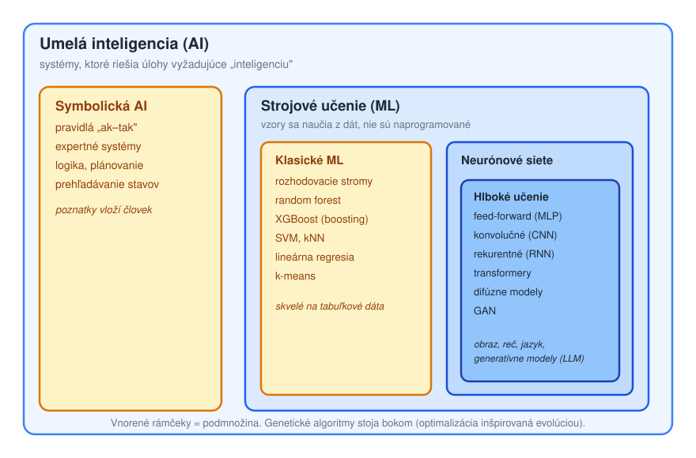

# Čo je umelá inteligencia

> **Poradie čítania:** ← [Vývojové prostredie](../00-prostredie/01-vyvojove-prostredie.md) · **lekcia 1** · [Režimy strojového učenia](02-rezimy-strojoveho-ucenia.md) →

**Umelá inteligencia (AI)** je široký pojem pre systémy, ktoré riešia úlohy, na aké by sme u človeka povedali, že vyžadujú „inteligenciu": rozpoznať objekt na fotke, preložiť vetu, naplánovať trasu, odporučiť film alebo hrať šach. AI nie je jedna konkrétna technológia — je to skôr **cieľ** (napodobniť rozumné správanie), ku ktorému vedie viacero rôznych ciest.

Historicky sa vyvinuli dva veľké prúdy:

1. **Symbolická AI** (staršia, „Good Old-Fashioned AI"). Znalosti a pravidlá do systému **vloží človek** vo forme explicitných pravidiel typu „ak–tak", logických výrokov, rozhodovacích tabuliek alebo prehľadávania stavového priestoru. Príklady: expertné systémy pre diagnostiku, šachové enginy so stromom ťahov, plánovače, pravidlové chatboty. Výhoda: je to **vysvetliteľné** a predvídateľné. Nevýhoda: pravidiel je pri reálnych problémoch priveľa a niektoré veci (napr. „čo je na obrázku mačka") sa pravidlami napísať prakticky nedajú.

2. **Strojové učenie (Machine Learning, ML)** (dominantné dnes). Systém sa **naučí vzory priamo z dát**, namiesto toho, aby mu ich niekto naprogramoval. Ukážeme mu tisíce príkladov a on si sám nastaví vnútorné parametre tak, aby dobre predpovedal. Sem patria stromy, XGBoost aj celé hlboké učenie.

## Taxonómia — ako do seba veci zapadajú

Kľúčové je pochopiť **vzťah vnorenia**: hlboké učenie je podmnožinou neurónových sietí, tie sú podmnožinou strojového učenia a to je podmnožinou AI. Bežná chyba je používať „AI" a „neurónové siete" ako synonymá — v skutočnosti je neurónová sieť len jeden (dnes veľmi úspešný) nástroj vo veľkej škatuli AI. **Hlboké učenie (deep learning)** pritom nie je samostatná technológia, ale jednoducho neurónové siete s väčším počtom vrstiev; hranica nie je ostrá, no zhruba od dvoch-troch skrytých vrstiev hovoríme o hlbokej sieti. Pojem sa ujal preto, že práve hĺbka — a s ňou schopnosť učiť sa hierarchiu príznakov — stála za prelomovými výsledkami v rozpoznávaní obrazu a reči po roku 2012.

Kde v tejto mape ležia modely z tohto dokumentu:

- **Rozhodovacie stromy, random forest a XGBoost** patria do strojového učenia, ale nie sú to neurónové siete. Hovorí sa im aj „klasické" metódy ML — a ako uvidíme, na tabuľkových dátach klasické neznamená horšie.
- **Feed-forward siete (MLP) a konvolučné siete (CNN)** sú neurónové siete; ak majú veľa vrstiev, spadajú do hlbokého učenia.

---

## Kontrolné otázky

1. Vysvetlite vzťah vnorenia AI ⊃ ML ⊃ neurónové siete ⊃ deep learning. Kam v tejto mape patrí XGBoost a kam CNN?
2. Kedy má ešte dnes zmysel symbolická AI (pravidlá napísané človekom) a kedy je strojové učenie jediná schodná cesta?
3. Prečo je nesprávne používať pojmy „AI" a „neurónová sieť" ako synonymá?

---

### Súvisiace dokumenty

- [02-rezimy-strojoveho-ucenia.md](02-rezimy-strojoveho-ucenia.md) — **nasleduje**: s učiteľom, bez učiteľa, posilňované
- [tutorials/02-typy-modelov](../02-typy-modelov/README.md) — konkrétne rodiny modelov z tejto mapy
