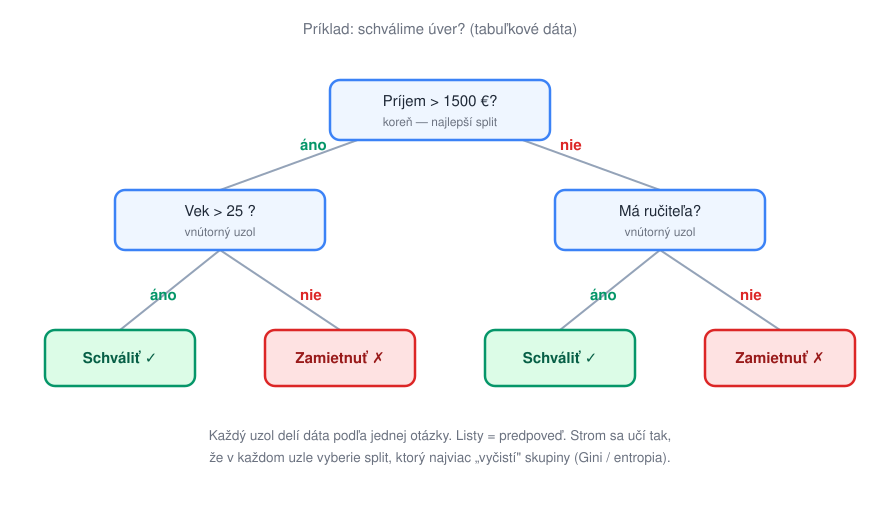

# Rozhodovacie stromy

> **Poradie čítania:** ← [Metriky](../01-prehlad/04-metriky.md) · **lekcia 2** · [Random Forest a XGBoost](02-random-forest-a-xgboost.md) →

**Rozhodovací strom** rozdeľuje dáta sériou jednoduchých otázok typu „je príjem väčší ako 1500 €?". Každá otázka rozdelí dáta na dve vetvy; postupným vetvením sa dopracujeme k listu, ktorý obsahuje predpoveď.

**Ako sa učí:** algoritmus v každom uzle vyskúša možné otázky (splity) a vyberie tú, ktorá dáta najlepšie „vyčistí" — teda po rozdelení sú skupiny čo najviac homogénne (jedna vetva prevažne „schváliť", druhá prevažne „zamietnuť"). Miera nečistoty sa meria napr. **Gini indexom** alebo **entropiou**. Obe miery hovoria to isté iným jazykom: uzol, v ktorom sú všetky príklady jednej triedy, má nečistotu nulovú; uzol rozdelený presne pol na pol má nečistotu najvyššiu možnú. Algoritmus vždy siahne po splite, ktorý nečistotu zníži najviac, a vetvenie pokračuje, kým nie sú listy dostatočne čisté alebo kým sa nedosiahne maximálna hĺbka.

**Prečo sa jeden strom ľahko preučí:** ak strom necháme rásť bez obmedzenia, vetví sa dovtedy, kým v každom liste nezostane hŕstka príkladov — pokojne aj jediný. Taký strom má na trénovacích dátach stopercentnú úspešnosť, lenže posledné vetvenia už nezachytávajú skutočné vzory, iba náhodný šum konkrétnej vzorky („klient č. 4217 nesplatil, hoci všetko nasvedčovalo opaku"). Na nových dátach potom tieto pseudopravidlá škodia. Rast stromu sa preto obmedzuje — maximálnou hĺbkou, minimálnym počtom príkladov v liste alebo dodatočným orezávaním (*pruning*) — vždy je to však kompromis: prísne obmedzený strom zas stráca presnosť. S tým súvisí aj **nestabilita**: keďže sa splity vyberajú pažravo zhora nadol, malá zmena dát môže zmeniť už prvú otázku v koreni a celý zvyšok stromu sa poskladá inak.

**Typické použitie:** tabuľkové dáta — schvaľovanie úverov, medicínska triáž, jednoduché pravidlové rozhodovanie, kde chceme, aby sa výsledok dal ukázať a obhájiť.

| ✅ Výhody | ❌ Nevýhody |
|---|---|
| Veľmi **vysvetliteľné** — cestu k rozhodnutiu vie prečítať aj laik | Jeden strom sa ľahko **preučí** (overfitting) — zapamätá si šum v dátach |
| Netreba škálovať ani normalizovať vstupy | **Nestabilný** — malá zmena dát môže dať úplne iný strom |
| Zvláda číselné aj kategorické atribúty | Sám osebe má **nižšiu presnosť** ako ansámble |
| Rýchle trénovanie aj predikcia | Nevie dobre modelovať plynulé, „šikmé" hranice |

> Práve nestabilita a náchylnosť na preučenie viedli k tomu, že sa jednotlivé stromy skladajú do **ansámblov** — random forest a boosting.

---

## Kontrolné otázky

1. Ako strom vyberá otázku (split)? Čo meria Gini index alebo entropia?
2. Prečo sa jeden strom ľahko preučí a čo presne sa v ňom pri preučení deje?
3. Čo znamená, že strom je **nestabilný**, a prečo to vyplýva z pažravého výberu splitov?

---

### Súvisiace dokumenty

- [02-random-forest-a-xgboost.md](02-random-forest-a-xgboost.md) — **nasleduje**: ako sa zo slabých stromov skladá silný model
- [03-generalizacia-a-preucenie.md](../01-prehlad/03-generalizacia-a-preucenie.md) — preučenie a bias/variance
