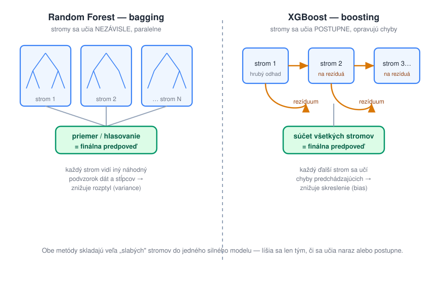

# Random Forest a XGBoost (ansámble stromov)

> **Poradie čítania:** ← [Rozhodovacie stromy](01-rozhodovacie-stromy.md) · **lekcia 2** · [XGBoost krok za krokom (ISO 8583)](03-xgboost-priklad-iso8583.md) →

Namiesto jedného stromu sa použije **veľa stromov naraz** a ich predpovede sa skombinujú. Existujú dve hlavné stratégie, ako to spraviť — a je dobré vidieť ich vedľa seba:

## Random Forest (bagging)

Natrénuje sa mnoho stromov (typicky stovky) **nezávisle a paralelne**. Aby neboli všetky rovnaké, vnesie sa do tréningu dvojitá náhoda:

1. každý strom dostane iný **bootstrap výber** dát — náhodnú vzorku trénovacích riadkov s opakovaním,
2. pri každom vetvení smie strom vyberať otázku len z **náhodnej podmnožiny stĺpcov**.

Finálna predpoveď je **priemer** (regresia) alebo **hlasovanie** (klasifikácia). Trik je v tom, že jednotlivé stromy pokojne môžu byť hlboké a preučené — každý sa však preučí na *iný* šum, lebo videl iné dáta a iné stĺpce. Pri spriemerovaní sa tieto náhodné chyby navzájom vyrušia a zostane to, na čom sa stromy zhodujú: skutočný vzor. Je to rovnaký princíp, ako keď priemer mnohých nepresných meraní dá oveľa presnejší odhad než ktorékoľvek jedno meranie. Random forest teda **znižuje rozptyl (variance)**, pričom skreslenie nechá zhruba tam, kde ho mal jednotlivý strom.

## XGBoost (gradient boosting)

**Boosting** ide na to opačne: stromy sa učia **postupne**, jeden po druhom, a každý sa sústredí na to, čo predchádzajúce pokazili. Malý príklad s odhadom ceny bytu, ktorého skutočná cena je 120 000 €: prvý strom odhadne 100 000 €, chyba (**rezíduum**) je teda +20 000 €. Druhý strom sa už neučí predpovedať cenu, ale toto rezíduum — odhadne povedzme +15 000 €. Priebežný súčet 115 000 € je bližšie k pravde a tretí strom opravuje zvyšných 5 000 €. Finálna predpoveď je **súčet** príspevkov všetkých stromov.

Na rozdiel od random forestu sa používajú **plytké stromy** (bežne hĺbka 3 až 6) — každý je sám osebe slabý model, ale stovky drobných opráv za sebou poskladajú veľmi presný celok. Boosting tak **znižuje skreslenie (bias)** a spravidla dosahuje vyššiu presnosť než bagging. Aby sa pri toľkých krokoch nezačal učiť šum, pripočítava sa každá oprava len čiastočne, prenásobená malým koeficientom (**learning rate**, napr. 0,1), a trénovanie sa zastaví, keď chyba na odloženej validačnej množine prestane klesať.

Kontrast sa oplatí zapamätať: **bagging skladá silné (hlboké) stromy paralelne a tlmí rozptyl; boosting skladá slabé (plytké) stromy sekvenčne a tlmí skreslenie.**

**XGBoost** (*eXtreme Gradient Boosting*) je najznámejšia, vysoko optimalizovaná implementácia gradient boostingu. Pridáva regularizáciu, prácu s chýbajúcimi hodnotami a efektívne paralelné budovanie stromov. Spolu s príbuznými (LightGBM, CatBoost) je to **dlhodobo najúspešnejší model na tabuľkové dáta** a takmer štandardný víťaz Kaggle súťaží mimo obrazu a textu.

Prečo na tabuľkách vyhrávajú stromy nad neurónovými sieťami? Tabuľkové stĺpce sú rôznorodé (eurá, roky, kategórie) a nemajú priestorovú ani sekvenčnú štruktúru, ktorú by sieť vedela využiť; riadkov bývajú tisíce až státisíce, nie milióny; a stromom neprekážajú rôzne škály ani chýbajúce hodnoty. Neurónová sieť tu nemá čo „objaviť" navyše — a zaplatíte za ňu dlhším trénovaním, náročnejším ladením a horšou vysvetliteľnosťou.

**Typické použitie:** predikcia na tabuľkových dátach — riziko úveru, predikcia dopytu/predaja, detekcia podvodov, ranking, scoring zákazníkov. Tam, kde máte stĺpce a riadky, začnite XGBoostom.

| ✅ Výhody | ❌ Nevýhody |
|---|---|
| **Špičková presnosť na tabuľkových dátach**, často lepšia než neurónky | Viac **hyperparametrov** na ladenie (počet stromov, hĺbka, learning rate) |
| Robustný, zvláda chýbajúce hodnoty a rôzne škály | Menej vysvetliteľný než jeden strom (ale existuje SHAP) |
| Random forest sa ťažko preučí a beží paralelne | Boosting je **sekvenčný** → pomalšie trénovanie na obrích dátach |
| Netreba veľa dát ani GPU | **Nehodí sa** na obraz/zvuk/text (surové pixely či slová) |

---

## Kontrolné otázky

1. Vysvetlite rozdiel medzi baggingom a boostingom jednou vetou. Ktorý z nich tlmí rozptyl a ktorý skreslenie?
2. Prečo random forest zámerne používa hlboké (preučené) stromy, kým boosting plytké?
3. Načo slúži learning rate v boostingu a čo sa stane, ak ho nastavíte na 1?
4. Prečo na tabuľkových dátach vyhrávajú stromy nad neurónovými sieťami?

---

### Súvisiace dokumenty

- [03-xgboost-priklad-iso8583.md](03-xgboost-priklad-iso8583.md) — **nasleduje**: celý mechanizmus prepočítaný na reálnych dátach
- [01-rozhodovacie-stromy.md](01-rozhodovacie-stromy.md) — stavebný prvok oboch ansámblov
- [06-ktory-model-kedy.md](06-ktory-model-kedy.md) — rozhodovacia tabuľka
