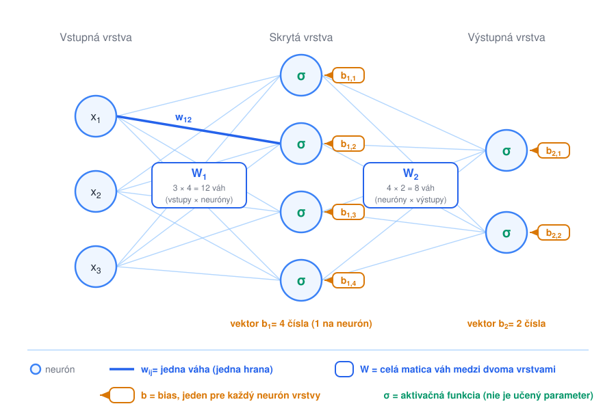
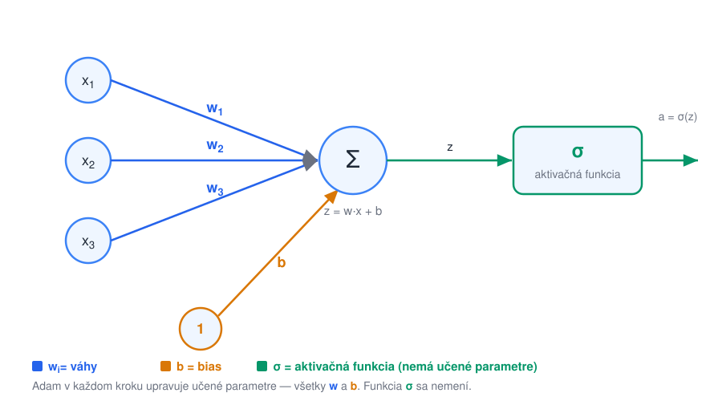

# Feed-forward neurónové siete (MLP)

> **Poradie čítania:** ← [XGBoost krok za krokom (ISO 8583)](03-xgboost-priklad-iso8583.md) · **lekcia 3** · [Konvolučné siete (CNN)](05-konvolucne-siete.md) →

**Feed-forward neurónová sieť** (viacvrstvový perceptrón, *MLP*) je najzákladnejší typ neurónovej siete. Skladá sa z vrstiev neurónov; informácia tečie **jedným smerom** — od vstupu cez skryté vrstvy k výstupu, bez cyklov.



Každý neurón spočíta vážený súčet svojich vstupov, pripočíta **bias** a prevedie výsledok cez nelineárnu **aktivačnú funkciu** (ReLU, sigmoid…):



## Prečo sú nelineárne aktivácie nevyhnutné

Predstavme si na chvíľu sieť **bez** aktivačných funkcií — každá vrstva by počítala len vážený súčet, teda lineárne zobrazenie y = W·x + b. Čo spraví druhá vrstva s výstupom prvej?

```text
  y = W₂ · (W₁ · x + b₁) + b₂  =  (W₂ · W₁) · x + (W₂ · b₁ + b₂)
```

Výsledok je opäť len vážený súčet pôvodných vstupov — s inou maticou váh a iným biasom. Inak povedané: **zloženie ľubovoľného počtu lineárnych vrstiev je stále jedna lineárna vrstva.** Sieť so sto vrstvami by nedokázala nič viac než obyčajná lineárna regresia — nevedela by oddeliť ani body, ktoré sa nedajú rozdeliť priamkou (klasický príklad je funkcia XOR). Pridávanie ďalších vrstiev by nepomohlo vôbec, len by pribúdali parametre.

Nelineárna aktivácia vložená medzi vrstvy toto „zrútenie" zlomí. Najpoužívanejšia **ReLU** je pritom prekvapivo jednoduchá: záporné hodnoty vynuluje, kladné nechá tak — max(0, z). **Sigmoid** stláča výstup do intervalu (0, 1), preto sa hodí na výstupnú vrstvu, keď má výstup vyjadrovať pravdepodobnosť. Vďaka nelinearite môže každá ďalšia vrstva rozhodovaciu hranicu „ohýbať" — a platí **veta o univerzálnej aproximácii**: už sieť s jednou dostatočne širokou nelineárnou skrytou vrstvou dokáže aproximovať ľubovoľnú spojitú funkciu. V praxi sa namiesto jednej obrovskej vrstvy používa viac menších — hlbšia sieť sa tú istú vec spravidla naučí s menším počtom neurónov.

Ako sa váhy a biasy ladia tréningom (forward pass → loss → backpropagation → update optimalizátorom Adam), podrobne rozoberá [01-adam-optimalizator.md](../03-ucenie/01-adam-optimalizator.md).

---

## Podrobný príklad: MLP na tých istých ISO 8583 transakciách

Zoberme **presne tie isté dáta**, na ktorých sme si ukázali [XGBoost](03-xgboost-priklad-iso8583.md) — desať kartových transakcií a príznak, či išlo o podvod. Tým istým datasetom cez dva rôzne modely sa najlepšie ukáže, čo neurónová sieť vyžaduje navyše.

A vyžaduje toho dosť. **XGBoost sme mohli pustiť rovno na surovú tabuľku**: stromu je jedno, či je stĺpec v eurách alebo v desatinách, kategórie vie spracovať natívne a chýbajúca hodnota je pre neho len ďalšia vetva. **MLP nič z toho nevie.** Vstupom siete je vektor reálnych čísel — a na tom, ako ten vektor zostavíme, závisí viac než na počte vrstiev.

### Krok 1: Príprava dát — čo MLP vyžaduje a strom nie

| Vlastnosť dát | XGBoost | MLP |
|---|---|---|
| Rôzne škály stĺpcov (€ vs. počty) | **jedno** — strom hľadá prah, nie vzdialenosť | **musí sa štandardizovať**, inak veľký stĺpec prevalcuje ostatné |
| Šikmé rozdelenie (pár obrích súm) | jedno — prah `> 500 €` funguje rovnako | **pomáha logaritmus** |
| Kategórie (`e-commerce`, MCC, krajina) | vie natívne | **musia sa zakódovať na čísla** (one-hot / embedding) |
| Chýbajúce hodnoty | vie sám (učí sa, kam ich poslať) | **musia sa doplniť** — `NaN` na vstupe otrávi celú sieť |
| Cyklické veličiny (hodina, deň v týždni) | zvládne prahmi | **treba zakódovať kruhovo**, inak je polnoc „ďaleko" od 23:00 |
| Nepotrebné stĺpce | ignoruje ich | pridávajú parametre a šum |

Prejdime si to príznak po príznaku.

#### 1a) Suma (DE4): najprv logaritmus, potom štandardizácia

Sumy idú od 7 € po 1 250 € — rozdelenie je silne **šikmé** (veľa malých, pár obrích). Sieť by z takého stĺpca dostala jeden extrémny vstup, ktorý by v prvej vrstve prevážil všetko ostatné. Preto **dva kroky**:

```text
   1. logaritmus:      x' = ln(1 + suma)      ← stlačí chvost, rozostupy zrovnomerní
   2. štandardizácia:  z  = (x' − μ) / σ      ← posunie na priemer 0, rozptyl 1
```

Prečo `ln(1 + x)` a nie `ln(x)`: pri sume 0 € by logaritmus utiekol do mínus nekonečna. Pre naše dáta vychádza `μ = 4,51` a `σ = 1,74` (počítané z log-hodnôt), takže transakcia za 890 € dostane `z = (6,79 − 4,51) / 1,74 = 1,31`.

> **Štandardizácia nie je kozmetika.** Bez nej by stĺpec „suma" (rádovo stovky) a stĺpec „počet transakcií" (rádovo jednotky) vstupovali do rovnakého váženého súčtu. Gradient pre váhu pri sume by bol stokrát väčší než pre váhu pri počte — a jeden learning rate nemôže vyhovovať obom naraz. Vznikne presne tá **dlhá úzka roklina**, o ktorej hovorí [02-problemy-pri-uceni.md](../03-ucenie/02-problemy-pri-uceni.md).

#### 1b) Čas (DE7): kruhové kódovanie namiesto čísla

Hodina je **cyklická veličina**: 23:50 a 00:10 sú od seba dvadsať minút, ale ako čísla sú na opačných koncoch stupnice. Keby sme do siete poslali holé číslo `23,8` a `0,17`, model by ich považoval za maximálne vzdialené — a práve nočné hodiny sú tu rizikové.

Riešenie je poslať **dve čísla namiesto jedného** — pozíciu na ciferníku:

```text
   sin_h = sin(2π · hodina / 24)
   cos_h = cos(2π · hodina / 24)
```

Tým sa každá hodina stane bodom na kružnici a polnoc leží tesne vedľa 23:00. Pre 03:17 (`hodina = 3,28`) vychádza `sin_h = 0,758`, `cos_h = 0,653`.

Alternatívou je one-hot 24 stĺpcov, ale to je zbytočne riedke a stráca sa informácia, že 3:00 a 4:00 sú susedia.

#### 1c) Spôsob vstupu (DE22): one-hot, nie číslovanie

Máme tri hodnoty: čip, bezkontakt, e-commerce. Lákavé je priradiť im `0, 1, 2` — a je to **chyba**. Sieť by tie čísla brala doslova: e-commerce by bolo „dvojnásobne viac" než bezkontakt a bezkontakt by ležal presne uprostred medzi čipom a e-commerce. Taký poriadok v dátach neexistuje; vymysleli by sme ho a model by sa ho poctivo naučil.

Správne je **one-hot** — jeden stĺpec na kategóriu, v ktorom je práve jedna jednotka:

```text
   čip          → [1, 0, 0]
   bezkontakt   → [0, 1, 0]
   e-commerce   → [0, 0, 1]
```

Číselné kódovanie má zmysel len tam, kde poradie **naozaj** je (napr. `nízke / stredné / vysoké riziko`); vtedy sa hovorí o ordinálnom kódovaní.

#### 1d) Vysoká kardinalita (MCC, krajina): zoskupiť alebo vnoriť

MCC má stovky hodnôt, krajín sú desiatky. One-hot by z toho spravil stovky prevažne nulových stĺpcov — sieť by mala tisíce parametrov na príznak, ktorý sa v dátach objaví trikrát. Dve praktické cesty:

- **Zoskupenie podľa domény** — MCC zlúčime do troch tried: `denná spotreba` (potraviny, doprava, lekáreň, čerpacie stanice), `tovar / e-shop` (elektronika, klenoty, odevy), `rizikové` (stávkovanie, kryptozmenárne). Z krajiny spravíme jediný príznak **`zahraničie`** = krajina obchodníka ≠ krajina vydania karty. Tri plus jeden stĺpec namiesto stoviek.
- **Embedding vrstva** — každej kategórii sa priradí učený vektor (napr. 8 čísel), ktorý sa trénuje spolu so sieťou. Je to presne ten mechanizmus, ktorý poháňa [embeddingy slov](../04-llm/04-embeddings.md), len nad MCC kódmi. Oplatí sa pri desaťtisícoch riadkov a viac; na náš príklad je to prestrelené.

#### 1e) Chýbajúce hodnoty

`NaN` vo vstupe znamená `NaN` vo výstupe aj v gradiente — sieť sa nerozbehne vôbec. Chýbajúce číselné hodnoty sa preto **doplnia** (medián býva bezpečnejší než priemer) a **pridá sa binárny stĺpec `chýbalo`**, aby si sieť mohla samotný fakt chýbania zapamätať ako informáciu. Pri kategóriách sa jednoducho zavedie kategória `neznáme`.

#### Hotová matica príznakov

Z pôvodných šiestich stĺpcov ISO 8583 je **11 čísel na riadok**:

| # | z_suma | sin_h | cos_h | z_vel | čip | bezk. | e-com | MCC den | MCC tovar | MCC rizik | zahr | **y** |
|---|---|---|---|---|---|---|---|---|---|---|---|---|
| 1 | −1,099 | 0,839 | −0,545 | −0,778 | 1 | 0 | 0 | 1 | 0 | 0 | 0 | 0 |
| 2 | −0,534 | −0,195 | −0,981 | −0,222 | 0 | 1 | 0 | 1 | 0 | 0 | 0 | 0 |
| **3** | **1,308** | **0,758** | **0,653** | **1,444** | 0 | 0 | **1** | 0 | **1** | 0 | **1** | **1** |
| 4 | −1,381 | −0,968 | −0,250 | −0,778 | 0 | 1 | 0 | 1 | 0 | 0 | 0 | 0 |
| 5 | 1,503 | 0,701 | 0,713 | 2,000 | 0 | 0 | 1 | 0 | 1 | 0 | 1 | 1 |
| 6 | 0,482 | −0,924 | 0,383 | −0,778 | 0 | 0 | 1 | 0 | 1 | 0 | 1 | 0 |
| 7 | −0,392 | 0,692 | −0,722 | −0,778 | 1 | 0 | 0 | 1 | 0 | 0 | 0 | 0 |
| 8 | 1,119 | 0,822 | 0,570 | 0,889 | 1 | 0 | 0 | 0 | 0 | 1 | 1 | 1 |
| 9 | −0,010 | −0,574 | −0,819 | −0,778 | 1 | 0 | 0 | 1 | 0 | 0 | 0 | 0 |
| 10 | −0,997 | −0,676 | 0,737 | −0,222 | 0 | 1 | 0 | 1 | 0 | 0 | 0 | 0 |

Tri veci, na ktoré sa pri príprave dát najčastejšie zabudne:

1. **Priemer a odchýlku počítajte len z trénovacej množiny** a tie isté hodnoty použite na validačnú aj testovaciu. Ak scaler „uvidí" testovacie dáta, unikne doň informácia o budúcnosti a výsledok bude optimistickejší než realita.
2. **Deľte podľa času, nie náhodne.** Trénujte na januári až marci, testujte na apríli. Náhodné delenie transakčných dát dáva model, ktorý sa učí z budúcnosti.
3. **Nevyváženosť tried** ošetrite váhami v loss funkcii (`pos_weight`), nie prevzorkovaním na začiatok. A nesledujte accuracy — pri 0,1 % podvodov je 99,9 % výsledok modelu, ktorý nerobí nič.

### Krok 2: Architektúra

Postavíme najmenšiu sieť, ktorá dáva zmysel — **11 → 4 → 1**:

```text
   vstup (11)          skrytá vrstva (4, ReLU)        výstup (1, sigmoid)
   z_suma  ──┐
   sin_h   ──┤          ┌── h1 ──┐
   cos_h   ──┤          ├── h2 ──┤
   z_vel   ──┼──  W₁ ──►├── h3 ──┼──  W₂ ──►  p = P(podvod)
   čip     ──┤          └── h4 ──┘
   …       ──┘
             11×4 = 44 váh + 4 biasy      4 váhy + 1 bias
```

Výstupný neurón má **sigmoid**, aby výsledok šiel čítať ako pravdepodobnosť, a loss je **binárna krížová entropia** `L = −ln(p)` pre podvod, `−ln(1−p)` pre poctivú transakciu.

> Spolu je to **53 parametrov na 10 trénovacích riadkov.** Taká sieť sa dáta naučí naspamäť skôr, než sa v nich stihne niečo nájsť — reálne by ste potrebovali desaťtisíce až milióny riadkov. Tu ide o to, aby sa dal každý krok prepočítať ceruzkou.

Váhy inicializujeme **He inicializáciou** (`std = √(2/11) ≈ 0,43`), biasy nulami:

| vstup | → h1 | → h2 | → h3 | → h4 |
|---|---|---|---|---|
| z_suma | −0,24 | 0,75 | 0,42 | 0,22 |
| sin_h | 0,46 | −0,67 | 0,27 | 0,61 |
| cos_h | 0,59 | −0,67 | −0,38 | 0,19 |
| z_vel | 0,14 | −0,32 | 0,53 | −0,02 |
| čip | −0,06 | −0,19 | 0,63 | −0,51 |
| bezkontakt | 0,65 | −0,13 | −0,14 | −0,13 |
| e-commerce | 0,16 | −0,09 | −0,33 | 0,46 |
| MCC denná | 0,42 | −0,16 | −0,06 | 0,79 |
| MCC tovar | −0,12 | 0,19 | −0,57 | −0,22 |
| MCC rizikové | −0,46 | −0,12 | 0,07 | 0,49 |
| zahraničie | −0,28 | −0,08 | 0,83 | 0,38 |

Výstupná vrstva: `W₂ = [0,32, −0,10, −0,26, −0,55]`, `b₂ = 0`.

### Krok 3: Forward pass — riadok 3 (podvod za 890 € o 3:17)

Prvý neurón skrytej vrstvy spočíta vážený súčet. Nuly z one-hot stĺpcov vypadnú samy:

```text
  z₁⁽¹⁾ = 1,308·(−0,24) + 0,758·0,46 + 0,653·0,59 + 1,444·0,14
          + 1·0,16 (e-com) + 1·(−0,12) (MCC tovar) + 1·(−0,28) (zahraničie)
        = −0,314 + 0,349 + 0,385 + 0,202 + 0,16 − 0,12 − 0,28
        =  0,382
```

Rovnako pre zvyšné tri neuróny, a na výsledok sa aplikuje ReLU:

| neurón | z (vážený súčet) | a = ReLU(z) |
|---|---|---|
| h1 | 0,382 | **0,382** |
| h2 | −0,406 | **0** ← ReLU vynulovala |
| h3 | 1,201 | **1,201** |
| h4 | 1,465 | **1,465** |

Neurón h2 sa na tomto riadku vôbec neozve. To je normálne — ReLU robí sieť **riedkou**, na každý vstup reaguje len časť neurónov. (Ak sa neurón nikdy neozve na *žiadnom* riadku, je mŕtvy a to už je problém — viď [02-problemy-pri-uceni.md](../03-ucenie/02-problemy-pri-uceni.md).)

Výstupná vrstva:

```text
  z₂ = 0,382·0,32 + 0·(−0,10) + 1,201·(−0,26) + 1,465·(−0,55) + 0
     = 0,122 − 0,312 − 0,806  =  −0,996

  p  = sigmoid(−0,996) = 1 / (1 + e^0,996) = 0,270
```

Sieť teda hovorí **27 % pravdepodobnosť podvodu** — a pritom to podvod bol. Nečudo: váhy sú zatiaľ náhodné.

### Krok 4: Loss

```text
  L = −ln(p) = −ln(0,270) = 1,310
```

Pre porovnanie: keby sieť hádala 50 : 50, loss by bol `−ln(0,5) = 0,693`. Náš model je teda na tomto riadku **horší než mincové hádzanie** — presne to teraz backpropagation opraví.

### Krok 5: Backpropagation — jeden krok

Chyba sa šíri sieťou odzadu. Na výstupe má krížová entropia so sigmoidom nádherne jednoduchý gradient — **rovnaký výraz, aký sme videli pri XGBooste**:

```text
  δ₂ = ∂L/∂z₂ = p − y = 0,270 − 1 = −0,730
```

Záporné znamienko hovorí „zvýš z₂", teda „zvýš predpovedanú pravdepodobnosť". Odtiaľ sa gradienty pre výstupné váhy získajú vynásobením aktiváciami, ktoré do nich vstúpili:

```text
  ∂L/∂W₂ = a · δ₂ = [0,382, 0, 1,201, 1,465] · (−0,730)
                  = [−0,279, 0, −0,877, −1,070]
```

Všimnite si nulu na druhom mieste: **neurón h2 nebol aktívny, takže sa jeho váha ani nepohne.** Kto sa na predpovedi nepodieľal, ten za ňu ani neručí.

Chyba pokračuje do skrytej vrstvy — vynásobí sa váhami `W₂` a prejde deriváciou ReLU (ktorá je 1 pre kladné `z`, 0 pre záporné):

```text
  δ₁ = (W₂ · δ₂) ⊙ [z₁ > 0]
     = [0,32, −0,10, −0,26, −0,55]·(−0,730) ⊙ [1, 0, 1, 1]
     = [−0,234, 0, 0,190, 0,402]
```

A gradient pre konkrétnu váhu je súčin **vstupu do nej** a **chyby za ňou** — napríklad pre váhy vedúce z príznaku `z_suma` (ktorý mal hodnotu 1,308):

```text
  ∂L/∂W₁[z_suma] = 1,308 · [−0,234, 0, 0,190, 0,402]
                 = [−0,306, 0, 0,248, 0,525]
```

### Krok 6: Update a výsledok

Obyčajným gradientným krokom s `lr = 0,1` (`W ← W − lr · ∂L/∂W`):

| váha | pred | po kroku |
|---|---|---|
| W₂ | 0,32 · −0,10 · −0,26 · −0,55 | **0,348 · −0,10 · −0,172 · −0,443** |
| W₁[z_suma] | −0,24 · 0,75 · 0,42 · 0,22 | **−0,209 · 0,75 · 0,395 · 0,168** |

A ten istý riadok znovu cez sieť:

```text
  p:    0,270  →  0,396
  loss: 1,310  →  0,927
```

Jeden krok, jedna transakcia — a model je bližšie k pravde. Toto sa opakuje pre každý riadok v batchi, každý batch v epoche a každú epochu, kým sa chyba na validačnej množine prestane zlepšovať. Váhy sa v praxi neposúvajú obyčajným SGD, ale **Adamom** — ten istý gradient, len s momentom a adaptívnym krokom pre každý parameter zvlášť ([01-adam-optimalizator.md](../03-ucenie/01-adam-optimalizator.md)).

### Ako to dopadne oproti XGBoostu

Na tomto type dát skončí MLP spravidla **horšie** než XGBoost — a stojí za to vedieť prečo:

- **Stromu stačí prah.** Pravidlo „e-commerce **a** viac než 4 transakcie za hodinu" nájde XGBoost dvoma splitmi. MLP musí tú istú hranicu poskladať z váženého súčtu a ReLU zlomov, čo si vyžaduje viac dát.
- **Príprava dát je práca navyše**, ktorá môže sama zaniesť chybu (zle zvolené zoskupenie MCC, scaler natrénovaný na testovacích dátach).
- **Riadkov býva málo.** Sieť s desiatkami tisíc parametrov potrebuje desaťtisíce až milióny príkladov; tabuľkové datasety bývajú menšie.

Kedy má MLP na tabuľke napriek tomu zmysel: keď máte **veľmi veľa riadkov** (milióny), keď potrebujete **spoločný model nad zmiešanými vstupmi** (tabuľka + text popisu + obrázok v jednej sieti), alebo keď model musí byť **priebežne dotrénovateľný** novými dátami bez pretrénovania od nuly.

### Kód

```python
import torch, torch.nn as nn
from sklearn.preprocessing import StandardScaler, OneHotEncoder
from sklearn.compose import ColumnTransformer
from sklearn.pipeline import Pipeline
from sklearn.impute import SimpleImputer
import numpy as np

# --- príprava dát: cyklický čas + logaritmus sumy ---
df["sin_h"] = np.sin(2*np.pi*df.hodina/24)
df["cos_h"] = np.cos(2*np.pi*df.hodina/24)
df["log_suma"] = np.log1p(df.suma)

prep = ColumnTransformer([
    ("num", Pipeline([("imp", SimpleImputer(strategy="median")),
                      ("sc",  StandardScaler())]),
     ["log_suma", "sin_h", "cos_h", "tx_za_hodinu"]),
    ("cat", OneHotEncoder(handle_unknown="ignore"),
     ["vstup", "mcc_skupina"]),
    ("bin", "passthrough", ["zahranicie"]),
])
X_train = prep.fit_transform(df_train)      # fit LEN na trénovacích dátach!
X_valid = prep.transform(df_valid)          # transform, nie fit_transform

model = nn.Sequential(
    nn.Linear(X_train.shape[1], 4), nn.ReLU(),
    nn.Linear(4, 1),                        # bez sigmoidu — má ho loss funkcia
)
# pri 1 podvode na 300 poctivých transakcií:
loss_fn = nn.BCEWithLogitsLoss(pos_weight=torch.tensor([300.0]))
opt = torch.optim.AdamW(model.parameters(), lr=1e-3)

for epoch in range(100):
    opt.zero_grad()
    loss = loss_fn(model(X_train).squeeze(), y_train)
    loss.backward()
    opt.step()

p = torch.sigmoid(model(X_valid)).detach()  # sigmoid až tu, pri predikcii
```

Dve veci v kóde, ktoré sa oplatí zapamätať: `BCEWithLogitsLoss` berie **logity** (surový výstup pred sigmoidom), lebo si sigmoid počíta sama numericky stabilne — dávať sigmoid do modelu *aj* do loss funkcie je klasická chyba. A `prep.fit_transform` sa volá **len na trénovacích dátach**; na validačné a testovacie ide `prep.transform`.

---

**Typické použitie:** univerzálny „lepiaci" model — klasifikácia a regresia na stredne veľkých dátach, koncové vrstvy v zložitejších sieťach (napr. klasifikačná hlava CNN alebo transformera), aproximácia funkcií v simuláciách.

| ✅ Výhody | ❌ Nevýhody |
|---|---|
| **Univerzálny aproximátor** — teoreticky zvládne ľubovoľný vzťah | Ignoruje štruktúru dát (pri obraze nevie, že susedné pixely spolu súvisia) |
| Základný stavebný blok všetkých hlbokých sietí | Veľa parametrov → **potrebuje veľa dát**, ľahko sa preučí |
| Zvláda nelineárne vzťahy, ktoré strom ťažko | Na tabuľkových dátach ho **XGBoost často predbehne** |
| Beží dobre na GPU | Menej vysvetliteľný — „čierna skrinka" |

---

## Kontrolné otázky

1. Čo by sa stalo, keby mala MLP sieť len lineárne aktivácie (žiadne ReLU/sigmoid)? Prečo by potom nepomáhalo pridávať vrstvy?
2. Ručne prepočítajte výstup neurónu s dvoma vstupmi, danými váhami, biasom a ReLU aktiváciou.
3. Prečo sa MLP na tabuľkových dátach zvyčajne neoplatí, hoci je univerzálnym aproximátorom?
4. Vymenujte štyri veci, ktoré musíte s tabuľkou spraviť pre MLP a nemusíte pre XGBoost. Pri každej povedzte, čo sa pokazí, ak na ňu zabudnete.
5. Prečo sa spôsob vstupu (čip / bezkontakt / e-commerce) nesmie zakódovať ako `0, 1, 2`? Kedy je naopak číselné kódovanie kategórie správne?
6. Prečo sa hodina kóduje ako dvojica `sin`, `cos` a nie ako číslo 0–23? Aký konkrétny problém to rieši?
7. Na riadku 3 mal neurón h2 zápornú aktiváciu, a preto nulový gradient. Vysvetlite, prečo je to v poriadku — a kedy sa z toho stáva problém.
8. Prečo sa priemer a smerodajná odchýlka pre štandardizáciu smú počítať len z trénovacej množiny? Čo presne unikne do modelu, ak to spravíte z celých dát?
9. Prečo `BCEWithLogitsLoss` očakáva logity a nie výstup zo sigmoidu? Čo sa stane, ak sigmoid dáte aj do modelu, aj do loss funkcie?
10. MCC kód má stovky hodnôt. Porovnajte one-hot, zoskupenie do tried a embedding vrstvu — čo si vyberiete pri 500 riadkoch a čo pri 5 miliónoch?

---

### Súvisiace dokumenty

- [05-konvolucne-siete.md](05-konvolucne-siete.md) — **nasleduje**: čo pridáva CNN oproti MLP
- [03-xgboost-priklad-iso8583.md](03-xgboost-priklad-iso8583.md) — **tie isté dáta druhým modelom**; porovnajte, čo si každý vyžaduje
- [01-adam-optimalizator.md](../03-ucenie/01-adam-optimalizator.md) — ako sa táto sieť trénuje
- [02-problemy-pri-uceni.md](../03-ucenie/02-problemy-pri-uceni.md) — mŕtve ReLU neuróny, miznúce gradienty
