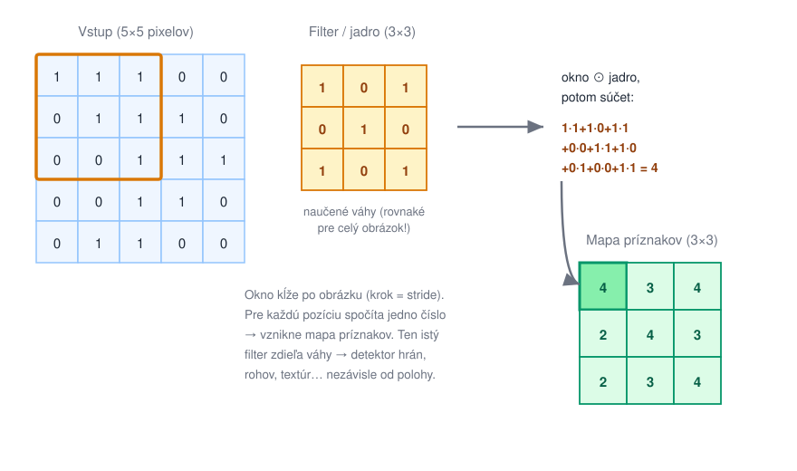
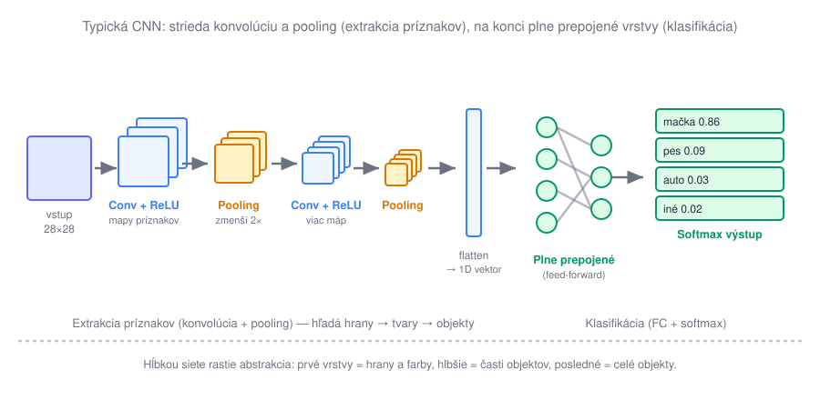

# Konvolučné neurónové siete (CNN)

> **Poradie čítania:** ← [Feed-forward siete (MLP)](04-feed-forward-siete.md) · **lekcia 3** · [Ktorý model kedy](06-ktory-model-kedy.md) →

**Konvolučná sieť (CNN)** je navrhnutá pre dáta s **priestorovou štruktúrou** — predovšetkým obrázky. Kľúčová myšlienka: namiesto toho, aby každý neurón videl všetky pixely (ako v MLP), použije malý **filter (jadro)**, ktorý kĺže po obrázku a hľadá lokálny vzor — hranu, roh, textúru.



Ten istý filter má **rovnaké váhy pre celý obrázok** (*weight sharing*), takže detektor hrany funguje rovnako v ľavom hornom aj pravom dolnom rohu. To dramaticky znižuje počet parametrov a dáva sieti **invarianciu voči posunu** — mačka je mačka, nech je kdekoľvek v zábere.

## Prečo sa volajú „konvolučné"

Názov nie je marketing, ale meno matematickej operácie, ktorú vrstva vykonáva — **konvolúcie**. Tá je oveľa staršia než neurónové siete; pozná ju spracovanie signálov aj klasické spracovanie obrazu. Konvolúcia berie dva vstupy — **signál** (u nás obrázok) a **jadro/kernel** (malá matica čísel) — a vyrobí tretí signál, ktorý hovorí, *nakoľko sa signál v okolí danej pozície podobá na jadro*. Robí to presne tak, ako ukazuje obrázok vyššie: jadro sa priloží na výrez signálu, vynásobia sa zodpovedajúce dvojice čísel, sčítajú sa a jadro sa posunie ďalej. Pre 2D obrázok `I` a jadro `K` veľkosti 3 × 3 je to jeden vzorec:

```text
S[i, j] = Σ(m=0..2) Σ(n=0..2)  I[i+m, j+n] · K[m, n]
```

Historicky sa presne takto robilo spracovanie obrazu **ručne**: rozmazanie (jadro samých jednotiek podelené deviatimi), doostrenie, detekcia hrán Sobelovým jadrom — inžinier tých deväť čísel navrhol podľa toho, čo chcel nájsť. Prelom CNN spočíva v tom, že tie čísla **nikto nenavrhuje, sieť si ich nájde sama** gradientným zostupom. „Konvolučná vrstva" teda znamená: *konvolúcia, ktorej jadro je učený parameter*. Odtiaľ názov celej architektúry — zaviedol ho Yann LeCun (siete LeNet, 1989 a 1998), predchodcovia dnešných modelov na rozpoznávanie obrazu.

Malá poznámka pre puntičkárov: to, čo počítajú PyTorch aj TensorFlow, je z matematického hľadiska **krížová korelácia** — pravá konvolúcia jadro pred priložením otočí o 180°. Keďže sú však hodnoty jadra učené, sieť sa jednoducho naučí otočenú verziu a výsledok je ten istý. Preto sa v strojovom učení názov „konvolúcia" používa pre obe.

## Koľko to stojí parametrov — CNN verzus MLP

Rozdiel oproti MLP vidno na číslach. Obrázok 200 × 200 pixelov v odtieňoch sivej má 40 000 vstupov. Keby sme naň pustili plne prepojenú vrstvu s 1 000 neurónmi, potrebovala by 40 000 × 1 000 = **40 miliónov váh** — a čo je horšie, každý vzor by sa naučila len pre presnú polohu, v ktorej sa v tréningových dátach vyskytol. Konvolučná vrstva s 32 filtrami veľkosti 3 × 3 si vystačí s 32 × (9 + 1) = **320 parametrami**, pretože tých deväť váh každého filtra sa opakovane použije na každú pozíciu obrázka. Dve kľúčové slová, ktoré za tým stoja: **lokálnosť** (neurón sa pozerá len na malé okienko, nie na celý obraz) a **weight sharing** (to isté okienko váh sa použije všade).


Obrázok ukazuje oba rozdiely naraz. Vľavo je **plné prepojenie**: každá čiara je samostatná váha a po sploštení už sieť nevie, že dva susedné pixely spolu súvisia. Vpravo sa tá istá deviatka váh priloží raz na ľavý horný roh a raz na pravý dolný — a keďže je to *to isté* jadro, vzor rozpoznaný v jednej polohe sieť rozpozná aj v druhej.

## Architektúra: konvolúcia, pooling, klasifikačná hlava

Celá sieť potom **strieda konvolúciu a pooling** (zmenšovanie), čím postupne extrahuje čoraz abstraktnejšie príznaky, a na konci pripojí feed-forward vrstvy na samotné rozhodnutie:



**Pooling** (najčastejšie *max pooling* 2 × 2) rozdelí mapu príznakov na okienka 2 × 2 a z každého ponechá len najväčšiu hodnotu. Mapa sa tým zmenší na polovicu v oboch rozmeroch, klesne objem ďalších výpočtov a sieť získa ďalšiu dávku odolnosti: ak sa detegovaná hrana posunie o pixel, maximum v okienku sa väčšinou nezmení.

Hĺbkou siete rastie abstrakcia: prvé vrstvy detegujú hrany a farby, stredné časti objektov (oko, koleso), posledné celé objekty. Stojí za tým jednoduchá geometria — **receptívne pole** (časť pôvodného obrázka, ktorú neurón „vidí") sa s každou vrstvou zväčšuje. Neurón v prvej konvolučnej vrstve vidí okienko 3 × 3 pixely. Neurón v druhej vrstve vidí okienko 3 × 3 *výstupov prvej vrstvy*, čo je v pôvodnom obrázku už 5 × 5 pixelov — a každý pooling toto rozpätie navyše zdvojnásobí. Po pár vrstvách tak jeden neurón zhŕňa informáciu z podstatnej časti obrázka, hoci sám počíta stále len s deviatimi váhami. Preto sa dá o hlbšej vrstve zmysluplne pýtať „je tu koleso?", kým prvá vrstva vie odpovedať len na „je tu hrana?".

## Ten istý obrázok v MLP a v CNN — krok za krokom

Najlepšie rozdiel vidno na konkrétnom príklade. Úloha: rozpoznať ručne písanú číslicu (dataset MNIST). **Vstup** je v oboch prípadoch rovnaký — obrázok 28 × 28 pixelov v odtieňoch sivej, teda matica 784 čísel (jas pixelu, znormalizovaný na 0 až 1). **Výstup** je tiež rovnaký — vektor 10 pravdepodobností pre triedy 0 až 9, napr. `[0.01, 0.00, …, 0.94, …]` → „je to sedmička". Líši sa všetko medzi tým.

**Feed-forward (MLP)** musí obrázok najprv **sploštiť** na jeden dlhý vektor — a tým zahodí 2D štruktúru. Sieť už nevie, že pixel 29 leží priamo pod pixelom 1; pre ňu je to len 784 nesúvisiacich čísel:

```text
vstup: 28 × 28 pixelov  (číslica „7")
   │  flatten — riadky sa vyskladajú za seba
   ▼
vektor 784 čísel                        ← 2D štruktúra je preč
   │  plne prepojená vrstva, 128 neurónov   (784 × 128 ≈ 100 000 váh)
   ▼
128 hodnôt (žiadny priestorový význam)
   │  plne prepojená vrstva, 10 neurónov + softmax
   ▼
výstup: 10 pravdepodobností  →  „7" (0.94)
```

Každý neurón prvej vrstvy vidí **všetkých 784 pixelov naraz** a má pre každý vlastnú váhu. Ak sa v tréningových dátach sedmička vyskytovala vľavo hore, sieť sa ju naučí spoznávať len tam — posunutú sedmičku vpravo dole vníma ako úplne iný vektor.

**CNN** ponechá obrázok ako 2D mriežku a namiesto splošťovania po ňom posúva malé filtre:

```text
vstup: 28 × 28 × 1  (číslica „7")
   │  konvolúcia 3×3, 8 filtrov          (len 8 × 10 = 80 parametrov)
   ▼
26 × 26 × 8   — 8 máp príznakov: „kde sú hrany, ťahy, uhly"
   │  max pooling 2×2
   ▼
13 × 13 × 8   — to isté, polovičné rozlíšenie
   │  konvolúcia 3×3, 16 filtrov
   ▼
11 × 11 × 16  — kombinácie ťahov: „vodorovná čiara hore + šikmý ťah"
   │  max pooling 2×2
   ▼
5 × 5 × 16
   │  flatten (400 hodnôt) + plne prepojená vrstva + softmax
   ▼
výstup: 10 pravdepodobností  →  „7" (0.94)
```

Všimnite si dve veci. Po prvé, **flatten a plne prepojené vrstvy prídu aj v CNN — ale až na konci**, keď už mapy príznakov nesú výroky typu „vľavo hore je vodorovná čiara" namiesto surových pixelov; posledná časť CNN je teda vlastne malé MLP nasadené na predspracované príznaky. Po druhé, ten istý filter na hranu funguje na ľubovoľnom mieste obrázka, takže posunutá sedmička dá tie isté (len posunuté) mapy príznakov — presne tá invariancia voči posunu, ktorú MLP nemá.

Zhrnutie rozdielu v jednej tabuľke:

| | MLP | CNN |
|---|---|---|
| Vstup vníma ako | plochý vektor 784 čísel | 2D mriežku 28 × 28 |
| Susednosť pixelov | ignoruje | využíva (filter vidí okienko 3 × 3) |
| Váhy | vlastná váha pre každý pixel a neurón | zdieľané váhy filtra pre celý obrázok |
| Posunutý objekt | musí sa ho učiť odznova pre každú polohu | rozpozná ho tie isté filtre |
| Rola v praxi | koncová klasifikačná hlava | extrakcia príznakov z obrazu |

**Typické použitie:** **spracovanie obrazu** — klasifikácia a detekcia objektov, segmentácia, rozpoznávanie tvárí, analýza medicínskych snímok, OCR; funguje aj na spektrogramy zvuku a iné mriežkové dáta. Praktická úloha v tomto repozitári: [rozpoznávanie obrázkov](../../zadania/rozpoznavanie-obrazkov.md).

| ✅ Výhody | ❌ Nevýhody |
|---|---|
| **Špička na obraz** a priestorové dáta | Vyžaduje **veľa dát a výpočtu** (GPU) |
| Weight sharing → menej parametrov, invariancia voči posunu | Málo vysvetliteľná — ťažko sa zisťuje „prečo" |
| Automaticky sa naučí príznaky (netreba ich ručne navrhovať) | Citlivá na adversariálne zmeny (malý šum ju zmätie) |
| Hierarchia hrany → tvary → objekty | Na **tabuľkových dátach zbytočná** — použite XGBoost |

> Pre postupnosti (text, časové rady) CNN nestačí — tam sa dnes používajú **transformery**, ktorým sa venuje [samostatný dokument](../04-llm/01-transformer-siete.md).

---

## Kontrolné otázky

1. Prečo CNN potrebuje rádovo menej parametrov než MLP na ten istý obrázok? (Kľúčové slová: weight sharing, lokálnosť.)
2. Opíšte cestu obrázka 28 × 28 sieťou: čo je vstup, čo výstup a v čom sa líši spracovanie v MLP a v CNN? Prečo MLP splošťovaním obrázka stráca informáciu?
3. Čo robí pooling a prečo sa hlbšie vrstvy „pozerajú" na väčšiu časť obrázka?
4. Odkiaľ má architektúra meno — čo je konvolúcia a čím sa konvolučná vrstva líši od ručne navrhnutého filtra v klasickom spracovaní obrazu?

---

### Súvisiace dokumenty

- [06-ktory-model-kedy.md](06-ktory-model-kedy.md) — **nasleduje**: zhrnutie, ktorý model na ktoré dáta
- [04-feed-forward-siete.md](04-feed-forward-siete.md) — sieť, oproti ktorej sa CNN vymedzuje
- [zadania/rozpoznavanie-obrazkov.md](../../zadania/rozpoznavanie-obrazkov.md) — zadanie 1
