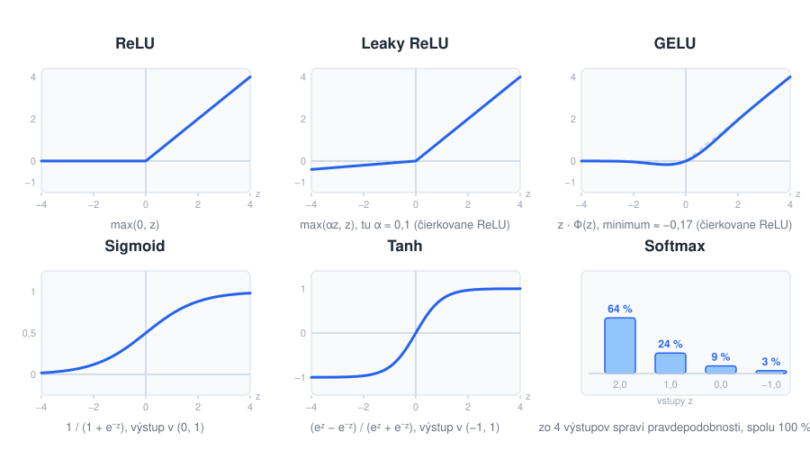
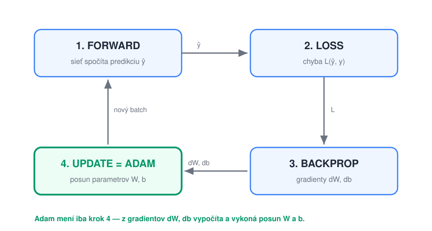

# Adam — kompletná špecifikácia optimalizátora pre feed-forward sieť

> **Poradie čítania:** ← [Ktorý model kedy](../02-typy-modelov/06-ktory-model-kedy.md) · **lekcia 3** · [Čo sa pri učení pokazí](02-problemy-pri-uceni.md) →

Tento dokument popisuje algoritmus **Adam** (Adaptive Moment Estimation) tak podrobne, aby
podľa neho študent vedel naprogramovať proces učenia doprednej (feed-forward) neurónovej
siete — bez použitia hotového frameworku.

Ak vám tréning **nefunguje** (loss stojí, osciluje alebo skončí ako `NaN`), pokračujte
samostatným dokumentom **[02-problemy-pri-uceni.md](02-problemy-pri-uceni.md)** — je to katalóg
porúch tréningu s návodom, ako každú z nich rozoznať a odstrániť.

---

## 0. Anatómia feed-forward siete — kde sú váhy, bias a aktivačná funkcia

Než sa pustíme do optimalizátora, treba vedieť, **čo vlastne Adam upravuje**. Nasledujúci
obrázok ukazuje jednoduchú doprednú sieť s troma vrstvami. Signál tečie zľava doprava
(preto „feed-forward"): vstupy → skrytá vrstva → výstupy.


Ako obrázok čítať:

- **Váhy sú hrany.** Každá modrá čiara medzi dvoma neurónmi je **jedno číslo** — jedna váha.
  Zvýraznená hrana `w₁₂` je váha zo vstupu `x₁` do 2. neurónu skrytej vrstvy. Váhy sa
  nekreslia po jednej, ale zhrnú sa do **matice**: všetkých 3 × 4 = 12 hrán medzi vstupom
  a skrytou vrstvou tvorí maticu `W₁`, všetkých 4 × 2 = 8 hrán medzi skrytou a výstupnou
  vrstvou tvorí `W₂`. Modré štítky sú umiestnené priamo na zväzku hrán, ktorý pomenúvajú.
- **Biasy sú v neurónoch, nie na hranách.** Bias nemá odkiaľ prísť — nie je to spojenie
  medzi neurónmi, ale **konštanta, ktorú si každý neurón pripočíta k svojmu váženému
  súčtu**. Preto je na obrázku nakreslený ako oranžový štítok so šípkou vstupujúcou do
  neurónu: `b₁,₁ … b₁,₄` sú biasy štyroch neurónov skrytej vrstvy a spolu tvoria **vektor
  `b₁`** (4 čísla), `b₂,₁` a `b₂,₂` sú biasy dvoch výstupných neurónov a tvoria **vektor
  `b₂`** (2 čísla). Platí jednoduché pravidlo: **koľko neurónov vo vrstve, toľko biasov.**
  Vstupná vrstva bias nemá — len podáva dáta ďalej.
- **Aktivácia je vnútri neurónu.** Zelené `σ` v každom neuróne (okrem vstupných) je
  aktivačná funkcia, ktorá sa aplikuje na výsledok `váhy · vstupy + bias`.

Táto sieť má teda spolu 12 + 4 + 8 + 2 = **26 učených parametrov**. Práve `W₁, b₁, W₂, b₂`
sú tie, ktoré Adam v každom kroku posúva. Aktivačná funkcia `σ` je pevne daná a nemení sa.

### Čo sa deje v jednom neuróne

Aby bolo jasné, kde presne váhy, bias a aktivácia vstupujú do výpočtu, priblížme si jeden
neurón:


Neurón robí dva kroky:

1. **Vážený súčet + bias** — každý vstup `xᵢ` sa vynásobí svojou **váhou `wᵢ`**, sčíta sa
   a pripočíta sa **bias `b`**:  `z = w₁x₁ + w₂x₂ + … + b`  (skrátene `z = w·x + b`).
2. **Aktivácia** — na `z` sa aplikuje **aktivačná funkcia `σ`** (napr. ReLU, sigmoid, tanh),
   ktorá dá výstup neurónu `a = σ(z)`. Aktivácia vnáša do siete nelinearitu — bez nej by
   celá sieť bola len jedna lineárna funkcia.

### Najčastejšie aktivačné funkcie a kedy ktorú použiť

| Funkcia | Vzorec | Výstup | Kedy sa používa |
|---|---|---|---|
| **ReLU** | `max(0, z)` | `⟨0, ∞)` | **predvolená voľba pre skryté vrstvy** — lacná na výpočet, netrpí miznúcim gradientom pre kladné `z` |
| **Sigmoid** | `1 / (1 + e⁻ᶻ)` | `(0, 1)` | **výstupná vrstva pri binárnej klasifikácii** — výstup sa dá čítať ako pravdepodobnosť (spam / nie spam) |
| **Softmax** | `eᶻⁱ / Σ eᶻʲ` | pravdepodobnosti so súčtom 1 | **výstupná vrstva pri klasifikácii do viacerých tried** — z 10 výstupov vytvorí rozdelenie pravdepodobnosti (číslice 0–9) |
| **Tanh** | `(eᶻ − e⁻ᶻ) / (eᶻ + e⁻ᶻ)` | `(−1, 1)` | skryté vrstvy, keď je výhodný výstup centrovaný okolo nuly; historicky v rekurentných sieťach |
| **Leaky ReLU** | `max(αz, z)`, čiže `z` pre `z > 0` a `αz` pre `z ≤ 0` (typicky `α = 0,01`) | `(−∞, ∞)` | náhrada ReLU tam, kde sieti odumierajú neuróny — záporná časť má malý sklon `α`, takže gradient nikdy nie je presne nula |
| **GELU** | `z · Φ(z)`, kde `Φ` je distribučná funkcia normálneho rozdelenia `N(0, 1)` | `⟨−0,17; ∞)` | **skryté vrstvy transformerov** (BERT, GPT) — hladká, všade diferencovateľná verzia ReLU |

K posledným dvom riadkom:

- **`α` v Leaky ReLU je hyperparameter**, nie učený parameter — volíte ho vy (bežne `0,01`)
  a Adam s ním nič nerobí. Varianta **PReLU** z neho robí učený parameter, používa sa však
  zriedka.
- **GELU** sa dá čítať ako „ReLU s mäkkým prechodom": namiesto tvrdého vypnutia pri nule
  násobí vstup pravdepodobnosťou `Φ(z)`, že je náhodná hodnota z `N(0, 1)` menšia než `z`.
  Pre veľké kladné `z` je `Φ(z) ≈ 1` (teda `GELU(z) ≈ z`), pre veľké záporné `z` je
  `Φ(z) ≈ 0` (teda `GELU(z) ≈ 0`). Keďže `Φ` sa počíta cez `erf`, v praxi sa často používa
  lacnejšia aproximácia:

  ```
  GELU(z) ≈ 0,5 · z · (1 + tanh(√(2/π) · (z + 0,044715 · z³)))
  ```

  Na rozdiel od ReLU je GELU pre mierne záporné `z` **mierne záporná** (minimum ≈ `−0,17`
  okolo `z ≈ −0,75`), a práve tá hladkosť okolo nuly je dôvod, prečo sa v hlbokých
  transformeroch trénuje stabilnejšie.

Ako tieto funkcie vyzerajú vykreslené (`z` na vodorovnej osi, výstup na zvislej):



Na grafoch je dobre vidieť to podstatné pre tréning — **aký strmý je sklon krivky**, lebo
sklon (derivácia) je presne to, čím sa pri backprope násobí gradient:

- **ReLU** má naľavo od nuly úplne vodorovnú čiaru → sklon 0 → neurón, ktorý sa tam dostane,
  už nedostane žiadny gradient („mŕtvy neurón").
- **Leaky ReLU** a **GELU** sú tam mierne naklonené (u GELU navyše hladko, bez zlomu),
  takže gradient nikdy nespadne presne na nulu. Čierkovaná sivá krivka je pre porovnanie
  ReLU.
- **Sigmoid** a **tanh** sú na oboch koncoch takmer ploché — pre `|z| > 3` je sklon blízky
  nule a gradient sa pri backprope cez viac vrstiev postupne „stratí" (**vanishing
  gradient**), takže sieť sa prestane učiť. Preto sa v **skrytých** vrstvách hlbokých sietí
  už takmer nepoužívajú.
- **Softmax** nie je funkcia jedného čísla, preto je vykreslený inak: berie celý vektor
  výstupov naraz a prevedie ho na pravdepodobnosti, ktoré dávajú spolu 100 %.

Praktické pravidlo: **skryté vrstvy = ReLU, výstupná vrstva podľa úlohy** — sigmoid pre
áno/nie, softmax pre výber z viacerých tried, žiadna aktivácia (identita) pre regresiu,
kde má výstup byť ľubovoľné číslo (napr. cena bytu).

Zhrnutie mapovania na algoritmus nižšie:

| Prvok na obrázku | Kde ho na obrázku nájdem | Symbol | Učený parameter? | Adam ho upravuje? |
|---|---|---|---|---|
| váhy | modré hrany medzi neurónmi (zhrnuté do matíc) | `W₁`, `W₂` (prvok `wᵢⱼ`) | áno | **áno** |
| bias | oranžové štítky so šípkou do neurónu | `b₁`, `b₂` (prvok `bₗ,ⱼ`) | áno | **áno** |
| aktivačná funkcia | zelené `σ` vnútri neurónu | `σ` | nie (pevná voľba) | nie |

Adam teda pracuje s gradientmi `dW` a `db` (parciálne derivácie chyby podľa `W` a `b`) —
presne s tými, ktoré vypočíta backprop.

---

## 1. Kontext: kde sa Adam nachádza v tréningovej slučke

Tréning siete je opakovanie štyroch krokov nad mini-batchmi dát:

1. **Forward** — sieť spočíta predikciu `ŷ` pre vstupný batch.
2. **Loss** — chybová funkcia (napr. cross-entropy) porovná `ŷ` so skutočnosťou `y`.
3. **Backward (backprop)** — spätným šírením sa spočítajú **gradienty** chyby podľa každého
   parametra: `dW` pre každú váhovú maticu, `db` pre každý bias.
4. **Update** — parametre sa posunú proti smeru gradientu. **Toto je práca optimalizátora.**

Obyčajný gradient descent (SGD) robí update takto:

```
W ← W − lr · dW
b ← b − lr · db
```

**Adam nahrádza iba krok 4.** Forward, loss aj backprop ostávajú nezmenené — Adam pracuje
s presne tými istými gradientmi `dW`, `db`, ktoré už z backpropu máte. Mení len *spôsob*,
akým sa z gradientu vypočíta krok.



Slučka beží dokola nad jednotlivými mini-batchmi. Adam sa uplatní **iba v kroku 4 (update)** —
dostane gradienty `dW`, `db` z backpropu (krok 3) a rozhodne, ako veľmi a ktorým smerom
posunúť `W` a `b`. Ostatné tri kroky sú od optimalizátora nezávislé.

---

## 2. Idea: prečo Adam funguje lepšie ako SGD

Adam kombinuje dve myšlienky:

- **Momentum (1. moment `m`)** — namiesto surového gradientu použije jeho **kĺzavý priemer**.
  To vyhladí šum medzi batchmi a dá updatu „zotrvačnosť", takže prejde ploché plató a plytké
  jamky.
- **Adaptívny krok (2. moment `v`)** — sleduje kĺzavý priemer **druhých mocnín** gradientu,
  čiže „ako veľké gradienty daný parameter mával". Krok pre každý parameter sa vydelí
  odmocninou tejto hodnoty:
  - parameter s **veľkými** gradientmi → menší, opatrnejší krok,
  - parameter s **malými** gradientmi → väčší krok.

Výsledok: **každý parameter má vlastnú, automaticky prispôsobenú rýchlosť učenia**, a tréning
je menej citlivý na voľbu `lr` než čisté SGD.

---

## 3. Matematické základy — ako to celé funguje

Táto časť vysvetľuje matematiku za algoritmom. Nie je nutná na to, aby ste Adam
naprogramovali, ale je nutná na to, aby ste rozumeli, *prečo* vzorce vyzerajú tak, ako vyzerajú.

### 3.1 Cieľ: minimalizácia chybovej funkcie

Tréning je **optimalizačná úloha**. Máme chybovú (loss) funkciu `L(θ)`, ktorá závisí od
všetkých parametrov siete `θ = (W1, b1, W2, b2, …)`, a hľadáme také `θ`, pre ktoré je `L`
čo najmenšie.

**Gradient** `∇L(θ) = ∂L/∂θ` je vektor parciálnych derivácií — ukazuje smer **najstrmšieho
rastu** `L`. Preto ideme **proti** nemu:

```
θ ← θ − α · ∇L(θ)
```

To je gradient descent. Backprop nie je nič iné než efektívny výpočet `∇L(θ)` cez reťazové
pravidlo. Celý zvyšok je otázka: **ako dobre zvoliť veľkosť a smer kroku** z tohto gradientu.

### 3.2 Problém surového gradientu

Gradient z jedného mini-batchu je len **hlučný odhad** skutočného gradientu (počítame ho
z malej vzorky dát, nie z celého datasetu). To má dva dôsledky:

- **Šum** — smer skáče od batchu k batchu, update „kľučkuje".
- **Rôzne mierky** — niektoré parametre majú trvalo veľké gradienty, iné maličké. Jedno
  spoločné `α` je preto vždy kompromis: pre jedny parametre priveľké, pre druhé primalé.

Adam rieši oboje pomocou **exponenciálne kĺzavých priemerov (EMA)**.

### 3.3 Exponenciálne kĺzavý priemer (EMA)

EMA je spôsob, ako priebežne odhadovať priemer postupnosti hodnôt `g₁, g₂, g₃, …` bez toho,
aby sme si ich všetky pamätali:

```
mₜ = β · mₜ₋₁ + (1 − β) · gₜ
```

Rozpísaním rekurzie vidno, čo to naozaj počíta:

```
mₜ = (1 − β) · ( gₜ + β·gₜ₋₁ + β²·gₜ₋₂ + β³·gₜ₋₃ + … )
```

Je to teda **vážený priemer minulých hodnôt**, kde staršie príspevky exponenciálne miznú
(váha `βᵏ`). Čím je `β` bližšie k 1, tým „dlhšiu pamäť" má priemer a tým je hladší.
Zhruba priemeruje cez posledných `≈ 1/(1−β)` hodnôt:

- `β1 = 0.9` → priemer cez ~10 posledných gradientov (1. moment),
- `β2 = 0.999` → priemer cez ~1000 posledných hodnôt (2. moment).

### 3.4 Prvý moment `m` — vyhladený smer (momentum)

`m` je EMA samotného gradientu:

```
mₜ = β1 · mₜ₋₁ + (1 − β1) · gₜ
```

Je to **odhad strednej hodnoty** gradientu, `m ≈ E[g]`. Priemerovaním sa náhodný šum medzi
batchmi vyruší a ostane skutočný, konzistentný smer klesania. Fyzikálna analógia: gulička,
ktorá sa kotúľa dolu svahom a má **zotrvačnosť** — prejde ploché miesta aj plytké jamky
namiesto toho, aby v každom bode reagovala len na okamžitý sklon.

### 3.5 Druhý moment `v` — mierka gradientu

`v` je EMA **druhých mocnín** gradientu (po prvkoch):

```
vₜ = β2 · vₜ₋₁ + (1 − β2) · gₜ²
```

Je to **odhad `E[g²]`**, teda typická *veľkosť* gradientu daného parametra (nezáleží na
znamienku). `√v` má rozmer gradientu a hovorí „ako veľké kroky tento parameter zvyčajne
robí". Poznámka: `E[g²] = Var(g) + (E[g])²`, čiže `v` v sebe nesie aj informáciu o rozptyle
(neistote) gradientu.

### 3.6 Spojenie: update s adaptívnym krokom

Finálny update delí vyhladený smer typickou veľkosťou:

```
θ ← θ − α · m̂ / (√v̂ + ε)
```

Podiel `m̂ / √v̂` je bezrozmerný — je to niečo ako **„signál k šumu"** (SNR) daného parametra:

- Ak parameter dlhodobo ťahá jedným smerom (`|m|` veľké oproti `√v`) → podiel ≈ 1 → plný krok.
- Ak sa gradient len chaoticky knísa okolo nuly (`|m|` malé oproti `√v`) → podiel ≈ 0 →
  krok sa utlmí.

Preto **každý parameter dostane vlastnú, automaticky prispôsobenú rýchlosť učenia** a `α` len
škáluje celkovú veľkosť kroku (jeho voľba je oveľa menej citlivá než pri čistom SGD).
`ε` je len poistka proti deleniu nulou v miestach, kde je `√v̂` takmer nula.

### 3.7 Prečo bias correction — odvodenie

`m` a `v` inicializujeme na nuly. Nula ale nie je neutrálny štart — je to hodnota, ktorá
priemer **ťahá nadol**, kým sa „nerozbehne". Pozrime sa, ako veľmi. Ak by boli gradienty
zhruba stacionárne s priemerom `E[g]`, dá sa ukázať:

```
E[mₜ] = (1 − β1ᵗ) · E[gₜ]
```

Faktor `(1 − β1ᵗ)` je na začiatku výrazne menší než 1 (pre `t=1` je to len `1 − β1 = 0.1`),
takže `mₜ` skutočnú hodnotu **podhodnocuje**. Delením práve týmto faktorom skreslenie presne
odstránime:

```
m̂ₜ = mₜ / (1 − β1ᵗ)        (analogicky  v̂ₜ = vₜ / (1 − β2ᵗ))
```

Pre veľké `t` platí `βᵗ → 0`, takže `(1 − βᵗ) → 1` a korekcia sa prirodzene vytráca —
ovplyvňuje len prvé kroky. To je aj dôvod, prečo `t` musí začínať od **1**: pre `t=0` by bol
menovateľ `1 − β⁰ = 0`.

### 3.8 Krajina chybovej funkcie: lokálne minimá a sedlové body

Chybová funkcia `L(θ)` má v sieti s miliónom parametrov milión rozmerov a intuícia z „kopcovitej
krajiny" v 2D tu klame. Rozlišujme dva druhy **stacionárnych bodov** (miest, kde je gradient nulový):

- **Lokálne minimum** — do všetkých smerov to ide nahor. Optimalizátor tu uviazne natrvalo.
- **Sedlový bod** — do niektorých smerov to ide nahor, do iných nadol (ako sedlo na koni).
  Gradient je nulový, ale nie je to minimum — existuje cesta von.

Bežná obava je, že sieť uviazne v zlom lokálnom minime. Vo vysokej dimenzii je to však **málo
pravdepodobné**: aby bol bod lokálnym minimom, musela by krivosť smerovať nahor vo *všetkých*
miliónoch smerov naraz. Stačí jediný smer nadol a je to len sedlo — a čím viac rozmerov, tým
nepravdepodobnejšia je zhoda „všetky nahor". Preto sú stacionárne body v hlbokých sieťach drvivou
väčšinou **sedlá**, a tie zvyčajne nebývajú vysoko nad dosiahnuteľným optimom. Reálnou prekážkou
tréningu tak nie sú lokálne minimá, ale **ploché plató a dlhé úzke rokliny**, kde je gradient
maličký a tréning sa vlečie.

Práve tu pomáha kombinácia troch vecí, ktoré Adam a mini-batch tréning prinášajú:

- **šum mini-batchov** — gradient z malej vzorky nie je nikdy presne nulový, takže systém sám od
  seba „vypadne" zo sedla, na ktorom by presný (full-batch) gradient uviazol,
- **momentum** (`m`) — nazbieraná zotrvačnosť prenesie krok cez ploché plató,
- **adaptívny krok** (`v`) — v smeroch s trvalo maličkými gradientmi krok automaticky zväčší.

> Zaujímavý kontrast: metódy druhého rádu (napr. Levenberg–Marquardt), ktoré hľadajú miesta
> s nulovým gradientom, sú priťahované ku **každému** stacionárnemu bodu vrátane sediel. Preto
> je „nepresnosť" SGD/Adamu v hlbokom učení skôr výhodou než nedostatkom.

### 3.9 Zhrnutie matematiky

Adam v každom kroku odhaduje dva štatistické momenty gradientu — **priemer** (`m`, smer)
a **druhý moment** (`v`, mierku) — pomocou exponenciálne kĺzavých priemerov, opraví ich
rozbehové skreslenie a urobí krok v smere priemeru, škálovaný inverznou veľkosťou gradientu.
Tým spája **momentum** (hladký smer) a **adaptívny learning rate per parameter** do jedného
pravidla.

---

## 4. Hyperparametre

| Symbol | Význam | Odporúčaná hodnota |
|---|---|---|
| `lr` (α) | rýchlosť učenia (learning rate) | `0.001` |
| `β1` | koeficient vyhladzovania 1. momentu | `0.9` |
| `β2` | koeficient vyhladzovania 2. momentu | `0.999` |
| `ε` (epsilon) | malé číslo proti deleniu nulou | `1e-8` |

Tieto hodnoty sú štandardné a fungujú takmer vždy — začnite s nimi.

### Dva dodatky, ktoré uvidíte v praxi

Vo vlastnej implementácii ich netreba, ale v cudzom kóde na ne narazíte hneď (podrobne aj
s kódom sú, spolu s ďalšími variantmi Adama, v [sekcii 8](#8-modifikácie-adama-pre-lepšiu-konvergenciu)):

- **AdamW** — variant, ktorý pridáva **weight decay** (pokutu za veľké váhy, viď regularizácia
  v [03-generalizacia-a-preucenie.md](../01-prehlad/03-generalizacia-a-preucenie.md)) tak, že ju odpočíta priamo od parametra
  (`P ← P − lr·(m̂/(√v̂+ε) + λ·P)`), a nie cez gradient. V bežnom Adame sa totiž decay pretlačí
  cez adaptívne delenie a účinkuje na každý parameter inak silno. Dnes je AdamW **predvoľba**
  pri trénovaní transformerov a `torch.optim.AdamW` je v `transformers` štandard.
- **Rozvrh learning rate** (*lr schedule*) — `lr` sa nedrží konštantný: typicky pár stoviek krokov
  lineárne rastie z nuly (*warmup* — na štarte sú `m` a `v` odhadnuté z pár vzoriek a plný krok
  podľa nich by model rozhodil) a potom pomaly klesá (kosínusovo alebo lineárne) k nule. Pri malých sieťach zo zadania 1 to
  nepotrebujete, pri fine-tuningu LLM to nastavuje knižnica za vás.

---

## 5. Stavové premenné

Adam si musí **medzi krokmi pamätať stav** pre **každý** parameter siete. Pre každú váhovú
maticu `W` a každý bias `b` si drží:

- `m` — 1. moment (kĺzavý priemer gradientu), **rovnaký tvar ako parameter**,
- `v` — 2. moment (kĺzavý priemer druhých mocnín gradientu), **rovnaký tvar ako parameter**.

Navyše jeden spoločný čítač:

- `t` — poradové číslo kroku (počet doteraz vykonaných updateov), celé číslo.

**Inicializácia (pred tréningom):**

```
pre každý parameter P (každé W, každé b):
    m_P = pole núl s rovnakým tvarom ako P
    v_P = pole núl s rovnakým tvarom ako P
t = 0
```

> Pozor: `m` a `v` **nie sú zdieľané** medzi parametrami. Ak má sieť vrstvy s `W1, b1, W2, b2, …`,
> každý z nich má vlastné `m` a `v`.

---

## 6. Algoritmus jedného update kroku

Vykonáva sa **raz za mini-batch**, po backprope, pre **každý** parameter zvlášť (`P` je
parameter, `g` je jeho gradient z backpropu, napr. `P = W`, `g = dW`):

```
t ← t + 1                              # zvýš čítač krokov (raz za batch, spoločné)

# --- pre každý parameter P s gradientom g: ---

m ← β1 · m + (1 − β1) · g              # aktualizuj 1. moment (po prvkoch)
v ← β2 · v + (1 − β2) · (g ⊙ g)        # aktualizuj 2. moment (g² po prvkoch)

m̂ ← m / (1 − β1^t)                     # bias correction 1. momentu
v̂ ← v / (1 − β2^t)                     # bias correction 2. momentu

P ← P − lr · m̂ / (sqrt(v̂) + ε)         # samotný update parametra (po prvkoch)
```

Všetky operácie (`⊙`, `sqrt`, delenie) sú **po prvkoch** (element-wise) — `m`, `v`, `g` aj `P`
majú rovnaký tvar. Zmysel dvoch riadkov s bias correction je odvodený v sekcii 3.7; pri
implementácii z nich stačí zapamätať si dôsledok: `t` musí v prvom kroku byť **1**, preto sa
`t ← t + 1` robí hneď na začiatku.

---

## 7. Referenčná implementácia (NumPy)

Ilustračná, samostatná trieda. `params` je zoznam parametrov, `grads` zoznam ich gradientov
v **rovnakom poradí** (napr. `[W1, b1, W2, b2]` a `[dW1, db1, dW2, db2]`).

```python
import numpy as np

class Adam:
    def __init__(self, params, lr=0.001, beta1=0.9, beta2=0.999, eps=1e-8):
        self.lr = lr
        self.beta1 = beta1
        self.beta2 = beta2
        self.eps = eps
        self.t = 0
        # vlastné m a v pre každý parameter, inicializované na nuly
        self.m = [np.zeros_like(p) for p in params]
        self.v = [np.zeros_like(p) for p in params]

    def step(self, params, grads):
        """Vykoná jeden update krok. Mení params na mieste (in-place)."""
        self.t += 1
        for i, (p, g) in enumerate(zip(params, grads)):
            # 1. a 2. moment (po prvkoch)
            self.m[i] = self.beta1 * self.m[i] + (1 - self.beta1) * g
            self.v[i] = self.beta2 * self.v[i] + (1 - self.beta2) * (g * g)

            # bias correction
            m_hat = self.m[i] / (1 - self.beta1 ** self.t)
            v_hat = self.v[i] / (1 - self.beta2 ** self.t)

            # update parametra (in-place, aby sa zmena prejavila v sieti)
            p -= self.lr * m_hat / (np.sqrt(v_hat) + self.eps)
```

### Použitie v tréningovej slučke

```python
opt = Adam(params=[W1, b1, W2, b2], lr=0.001)

for epoch in range(num_epochs):
    for X_batch, y_batch in batches(X_train, y_train, batch_size=64):
        y_hat = forward(X_batch)                 # 1. forward
        loss  = cross_entropy(y_hat, y_batch)    # 2. loss
        dW1, db1, dW2, db2 = backward(...)        # 3. backprop
        opt.step([W1, b1, W2, b2],
                 [dW1, db1, dW2, db2])            # 4. update (Adam)
```

> Dôležité: `p -= ...` mení pole **na mieste**. Ak vo vašej sieti nie sú parametre uložené
> ako meniteľné NumPy polia zdieľané s tréningom, upravte tak, aby `step` vracal nové hodnoty
> a vy si ich uložili späť do siete.

---

## 8. Modifikácie Adama pre lepšiu konvergenciu

Adam z roku 2014 je dodnes rozumná predvoľba, ale desať rokov praxe odhalilo niekoľko jeho
slabín. Odpoveďou je celá rodina variantov — a dobrá správa je, že **takmer každý z nich mení
iba jeden–dva riadky** algoritmu zo sekcie 6. Ak máte funkčného Adama, máte aj kostru pre
všetky nasledujúce úpravy.

Rozdeľme si ich do troch skupín:

- **A. Varianty jadra** — menia samotný vzorec updatu (8.1 – 8.6).
- **B. Obaly okolo optimalizátora** — Adam nechajú tak, ako je, a pridajú niečo navyše
  (8.7 – 8.10). V praxi prinášajú väčší úžitok než výmena variantu.
- **C. Úsporné varianty pre veľké modely** — obetujú kúsok kvality za dramaticky menšiu
  pamäť (8.11).

Značenie ostáva zo sekcie 6: `P` je parameter, `g` jeho gradient, `m`, `v` momenty,
`m̂`, `v̂` momenty po bias correction, `α` (`lr`) rýchlosť učenia.

---

### 8.1 AdamW — oddelený weight decay (*decoupled weight decay*)

**Problém.** Klasická L2 regularizácia sa pridáva do gradientu: `g ← g + λ·P`. V Adame
ale celý gradient následne prejde delením `√v̂`. Pokuta za veľké váhy sa tak pre parameter
s veľkými gradientmi **zoslabí** a pre parameter s malými gradientmi **zosilní** — presne
naopak, než by regularizácia mala fungovať. V praxi to znamená, že `λ` v Adame účinkuje
nepredvídateľne a treba ho ladiť spolu s `lr`.

**Riešenie (Loshchilov & Hutter, 2017).** Decay sa neposiela cez gradient, ale odpočíta sa
**priamo od parametra**, mimo adaptívnej časti:

```
P ← P − lr · m̂ / (√v̂ + ε)   −   lr · λ · P
                                  └── weight decay, neprechádza delením √v̂
```

```python
# v step(), na konci cyklu cez parametre
p -= self.lr * m_hat / (np.sqrt(v_hat) + self.eps)
if self.weight_decay:
    p -= self.lr * self.weight_decay * p     # oddelený decay
```

**Kedy použiť:** prakticky vždy, keď chcete regularizovať. `torch.optim.AdamW` je dnes
predvolený optimalizátor pre transformery a `λ` (`weight_decay`) sa typicky volí `0.01`
až `0.1`. Dôležitá konvencia: **decay sa neaplikuje na biasy a na parametre normalizačných
vrstiev** (LayerNorm) — tie majú byť voľné, inak sa škáluje aktivácia a tréning sa zhorší.

> Pozor na detail: v `torch.optim.AdamW` je decay násobený `lr` (ako vo vzorci vyššie),
> takže keď zmeníte `lr`, mení sa aj efektívna sila regularizácie. Pri prechode z Adamu
> na AdamW preto `λ` vždy preladíte nanovo.

---

### 8.2 AMSGrad — poistka proti „zabudnutému" veľkému gradientu

**Problém.** `v` je *kĺzavý* priemer, takže **zabúda**. Ak sa raz za čas objaví batch
s veľkým informatívnym gradientom, `v` sa síce nadvihne, ale po pár stovkách krokov klesne
naspäť. Efektívny krok `α/√v̂` sa tak môže **zväčšovať** a Adam v takom prípade nemusí
konvergovať ani na jednoduchej konvexnej úlohe (Reddi et al., 2018 — to je ten článok,
ktorý našiel chybu v pôvodnom dôkaze konvergencie Adama).

**Riešenie.** Pamätať si **maximum** doteraz videného `v` a deliť ním:

```
v_max ← max(v_max, v̂)          (po prvkoch)
P ← P − lr · m̂ / (√v_max + ε)
```

```python
self.v_max[i] = np.maximum(self.v_max[i], v_hat)
p -= self.lr * m_hat / (np.sqrt(self.v_max[i]) + self.eps)
```

Efektívny learning rate je tým pádom **monotónne neklesajúci menovateľ**, čiže krok sa nikdy
sám od seba nezväčší.

**Kedy použiť:** keď loss počas tréningu občas „vyskočí" alebo tréning nekonverguje
a podozrievate nestabilitu adaptívneho kroku. V `torch.optim.Adam(..., amsgrad=True)` je to
jeden prepínač. Cena: **o polovicu väčší stav optimalizátora** (tri polia na parameter
namiesto dvoch) a v praxi je zlepšenie na reálnych úlohách zmiešané — teoretická poistka,
nie univerzálne zrýchlenie.

---

### 8.3 Nadam — Adam s Nesterovovým momentom

**Myšlienka.** Klasické momentum sa pozerá **dozadu** (kam som šiel doteraz). Nesterovovo
momentum sa pozerá **dopredu**: gradient vyhodnotí až v bode, kam ma zotrvačnosť aj tak
odnesie, takže vie skôr „zabrzdiť" pred stenou. Nadam (Dozat, 2016) túto myšlienku dostane
do Adama bez nutnosti počítať gradient dvakrát — stačí do updatu primiešať aktuálny gradient:

```
m̂ ← β1 · m / (1 − β1^(t+1))  +  (1 − β1) · g / (1 − β1^t)
P ← P − lr · m̂ / (√v̂ + ε)
```

Prvý člen je „momentum posunuté o krok dopredu", druhý dopĺňa príspevok práve spočítaného
gradientu.

**Kedy použiť:** ak hľadáte lacné zrýchlenie prvých epôch. Býva o niečo rýchlejší než Adam na
začiatku tréningu, rozdiel na konci je zvyčajne malý. V PyTorchi `torch.optim.NAdam`.

---

### 8.4 RAdam — rektifikovaný Adam (warmup „zadarmo")

**Problém.** V prvých krokoch je `v̂` odhadnuté z hŕstky vzoriek, takže má **obrovský
rozptyl**. Náhodne malé `√v̂` znamená obrovský krok — a jediný taký krok môže model zaviesť do
zlej oblasti, z ktorej sa už nedostane. Presne preto sa v praxi používa *warmup* (8.9).

**Riešenie (Liu et al., 2019).** RAdam rozptyl adaptívneho člena **spočíta** a krok ním
vynásobí. Pokiaľ je odhad ešte nedôveryhodný, adaptívnu časť úplne vypne a urobí obyčajný
krok s momentom:

```
ρ∞ = 2/(1 − β2) − 1                                  # dĺžka pamäte 2. momentu (pre β2=0.999 ≈ 1999)
ρₜ = ρ∞ − 2t·β2^t / (1 − β2^t)                       # "koľko vzoriek už v̂ reálne videlo"

ak ρₜ > 4:                                            # odhad je dôveryhodný
    rₜ = sqrt( ((ρₜ−4)(ρₜ−2)·ρ∞) / ((ρ∞−4)(ρ∞−2)·ρₜ) )   # rektifikačný faktor, rastie k 1
    P ← P − lr · rₜ · m̂ / (√v̂ + ε)
inak:                                                 # prvých ~5 krokov
    P ← P − lr · m̂                                    # SGD s momentom, bez delenia
```

**Kedy použiť:** ak nechcete ladiť dĺžku warmupu alebo ak vám tréning padá práve v prvých
stovkách krokov. V praxi RAdam warmup **nenahrádza úplne** — pri veľkých modeloch sa aj tak
zvykne kombinovať s krátkym warmupom. V PyTorchi `torch.optim.RAdam`.

---

### 8.5 AdaBelief — druhý moment z **odchýlky**, nie z veľkosti

**Myšlienka.** Adam delí typickou veľkosťou gradientu. AdaBelief (Zhuang et al., 2020) delí
tým, **ako veľmi sa gradient líši od toho, čo sme čakali** — teda od `m`:

```
s ← β2 · s + (1 − β2) · (g − m)²  + ε
P ← P − lr · m̂ / (√ŝ + ε)
```

Interpretácia je pekná: `s` je odhad **rozptylu** gradientu, čiže „nedôvery" v smer.

- Gradient sedí s predikciou (`g ≈ m`) → `s` malé → **veľký krok**. V dlhej rovnej dolinke
  tak Adam postupuje zbytočne pomaly (lebo `g²` je veľké), zatiaľ čo AdaBelief zrýchli.
- Gradient skáče okolo `m` → `s` veľké → **malý, opatrný krok**.

**Kedy použiť:** keď má úloha dlhé úzke „rokliny" a Adam v nich spomaľuje. Nie je súčasťou
PyTorchu, inštaluje sa ako balík `adabelief-pytorch`.

---

### 8.6 Adamax — ∞-norma namiesto druhej mocniny

Namiesto EMA druhých mocnín sa sleduje **kĺzavé maximum absolútnej hodnoty** gradientu:

```
u ← max(β2 · u, |g|)
P ← P − (lr / (1 − β1^t)) · m / (u + ε)
```

`u` je stabilnejšie než `√v̂` — jediný extrémny gradient sa neumocní na druhú, takže menovateľ
nevystrelí. Bias correction pre `u` netreba (maximum nie je skreslené nulovou inicializáciou).

**Kedy použiť:** pri riedkych gradientoch a embedding vrstvách, alebo keď tréning zhadzujú
ojedinelé obrovské gradienty. V PyTorchi `torch.optim.Adamax`.

---

### 8.7 Lookahead — „k krokov dopredu, jeden krok naspäť"

Lookahead (Zhang et al., 2019) nie je optimalizátor, ale **obal okolo ľubovoľného
optimalizátora** (teda aj Adama). Drží dve sady váh:

- **rýchle váhy `θ`** — tie posúva Adam ako obvykle,
- **pomalé váhy `φ`** — aktualizujú sa až **raz za `k` krokov**, a to interpoláciou:

```
každých k krokov (typicky k = 5 alebo 6):
    φ ← φ + β · (θ − φ)        # β typicky 0.5
    θ ← φ                      # rýchle váhy sa vrátia na pomalé
```

Pomalé váhy sa tak posúvajú v smere, ktorý Adam držal **konzistentne počas `k` krokov**,
a jednorazové výkyvy sa vyhladia. Efekt: menší rozptyl tréningu, menšia citlivosť na `lr`,
cena je jedna kópia váh navyše a pár riadkov kódu.

---

### 8.8 Orezávanie gradientu (*gradient clipping*)

Nie je to modifikácia Adama, ale v praxi **najúčinnejšia poistka konvergencie vôbec** —
a robí sa medzi krokom 3 (backprop) a krokom 4 (update). Ak celková norma gradientov
prekročí prah, celý vektor sa preškáluje:

```python
def clip_grad_norm(grads, max_norm=1.0):
    total = np.sqrt(sum(np.sum(g * g) for g in grads))   # globálna L2 norma
    if total > max_norm:
        scale = max_norm / (total + 1e-6)
        grads = [g * scale for g in grads]               # smer ostáva, dĺžka sa oreže
    return grads
```

Podstatné je, že sa škáluje **globálna norma cez všetky parametre naraz** (nie každý
parameter zvlášť) — tým sa zachová *smer* celkového gradientu. Typický prah je `1.0`.
Bez clippingu jeden zlý batch (napr. s outlierom) vygeneruje obrovský gradient, ktorý sa
cez `m` a `v` vlečie ďalších niekoľko sto krokov. Pri trénovaní LLM je clipping štandardom.

---

### 8.9 Rozvrh learning rate: warmup + kosínusový pokles

Druhý „obal", ktorý v praxi rozhodne o konvergencii viac než výber variantu Adama. `lr` sa
nedrží konštantný:

1. **Warmup** — prvých `T_w` krokov (typicky 1–5 % tréningu) lineárny rast z nuly. Dôvod je
   ten istý ako pri RAdame (8.4): na štarte sú `m` a `v` nespoľahlivé.
2. **Pokles (decay)** — potom kosínusový pokles k nule (alebo k `0.1·lr`). Veľké kroky
   na začiatku hľadajú správnu oblasť, malé na konci v nej doladia detail.

```python
import math

def lr_at(step, base_lr=1e-3, warmup=500, total=20000, min_lr=0.0):
    if step < warmup:                                     # 1. lineárny nábeh
        return base_lr * step / warmup
    progress = (step - warmup) / max(1, total - warmup)   # 0 → 1
    cos = 0.5 * (1 + math.cos(math.pi * progress))        # 1 → 0
    return min_lr + (base_lr - min_lr) * cos              # 2. kosínusový pokles

# v tréningovej slučke, pred opt.step(...):
opt.lr = lr_at(global_step)
```

Alternatívy: lineárny pokles (jednoduchší, takmer rovnako dobrý), *step decay* (vydelenie
desiatimi po pevných epochách, klasika z oblasti CNN) alebo `ReduceLROnPlateau` (zníženie `lr`,
keď validačný loss prestane klesať).

---

### 8.10 EMA váh (Polyak averaging) — zadarmo hladší model

Popri trénovaných váhach sa udržiava ich **kĺzavý priemer**, a na validáciu aj nasadenie
sa použije **on**, nie posledné váhy:

```python
ema = [p.copy() for p in params]
# po každom opt.step():
for e, p in zip(ema, params):
    e *= 0.999
    e += 0.001 * p          # e ← 0.999·e + 0.001·p
```

Posledné váhy neustále „poskakujú" okolo optima kvôli šumu mini-batchov; priemer cez posledných
~1000 krokov sedí bližšie v strede minima a takmer vždy validuje o niečo lepšie. Stojí to jednu
kópiu váh a nula výpočtu navyše. Používa sa štandardne pri difúznych modeloch a pri fine-tuningu.

---

### 8.11 Úsporné varianty pre veľké modely

Adam si pre **každý** parameter drží `m` aj `v`. Pri fp32 to znamená 4 B (parameter) + 4 B
(gradient) + 8 B (stav optimalizátora) = **16 bajtov na parameter**, teda pre model so 7 mld.
parametrov ~112 GB (ten istý rozpočet v zmiešanej presnosti, tak ako ho vidí fine-tuning, je
rozpísaný v [07-fine-tuning-lora.md](../04-llm/07-fine-tuning-lora.md#1-prečo-sa-celý-model-dotrénovať-nedá)).
Preto pri LLM vznikli varianty, ktoré stav zmenšujú:

| Variant | Ako šetrí | Stav na parameter | Poznámka |
|---|---|---|---|
| **Adafactor** | `v` pre maticu `n × m` neukladá celé, ale ako **súčin riadkových a stĺpcových priemerov** (`n + m` čísel namiesto `n·m`) | ~0 (`m` sa štandardne vôbec nedrží) | použitý pri trénovaní T5; kvalita mierne pod AdamW |
| **8-bit Adam** | `m` a `v` **kvantizuje** do 8 bitov (blokovo, s vlastnou mierkou) | 2 B | `bitsandbytes`; kvalita prakticky nerozoznateľná od AdamW |
| **Lion** | drží **len `m`**, update je iba `sign(...)` — bez delenia | 4 B | `lr` treba 3–10× menší a `λ` väčší než pri AdamW |

Lion (Chen et al., 2023) stojí za rozpísanie, lebo ukazuje, že adaptívny menovateľ nie je
posvätný — krok má vždy rovnakú veľkosť a mení sa len jeho znamienko:

```
update ← sign(β1 · m + (1 − β1) · g)      # ±lr pre každý parameter
P ← P − lr · (update + λ · P)
m ← β2 · m + (1 − β2) · g                 # moment sa aktualizuje až po update
```

---

### 8.12 Referenčná implementácia: AdamW s prepínačmi

Rozšírenie triedy zo sekcie 7 o oddelený weight decay a AMSGrad. Obe úpravy sú doslova po
jednom riadku navyše:

```python
import numpy as np

class AdamW:
    def __init__(self, params, lr=1e-3, beta1=0.9, beta2=0.999, eps=1e-8,
                 weight_decay=0.0, amsgrad=False):
        self.lr, self.beta1, self.beta2, self.eps = lr, beta1, beta2, eps
        self.weight_decay = weight_decay
        self.amsgrad = amsgrad
        self.t = 0
        self.m = [np.zeros_like(p) for p in params]
        self.v = [np.zeros_like(p) for p in params]
        self.v_max = [np.zeros_like(p) for p in params] if amsgrad else None

    def step(self, params, grads, decay_mask=None):
        """decay_mask: zoznam True/False — na ktoré parametre aplikovať weight decay
        (typicky False pre biasy a parametre LayerNormu)."""
        self.t += 1
        for i, (p, g) in enumerate(zip(params, grads)):
            self.m[i] = self.beta1 * self.m[i] + (1 - self.beta1) * g
            self.v[i] = self.beta2 * self.v[i] + (1 - self.beta2) * (g * g)

            m_hat = self.m[i] / (1 - self.beta1 ** self.t)
            v_hat = self.v[i] / (1 - self.beta2 ** self.t)

            if self.amsgrad:                                     # 8.2
                self.v_max[i] = np.maximum(self.v_max[i], v_hat)
                v_hat = self.v_max[i]

            p -= self.lr * m_hat / (np.sqrt(v_hat) + self.eps)

            if self.weight_decay:                                # 8.1
                if decay_mask is None or decay_mask[i]:
                    p -= self.lr * self.weight_decay * p
```

Použitie so všetkými doplnkami z tejto sekcie:

```python
opt = AdamW(params, lr=1e-3, weight_decay=0.01, amsgrad=False)
step = 0

for epoch in range(num_epochs):
    for X_batch, y_batch in batches(X_train, y_train, batch_size=64):
        y_hat = forward(X_batch)
        loss  = cross_entropy(y_hat, y_batch)
        grads = backward(...)

        grads = clip_grad_norm(grads, max_norm=1.0)   # 8.8
        opt.lr = lr_at(step)                          # 8.9
        opt.step(params, grads, decay_mask=mask)      # mask: False pre biasy
        step += 1
```

---

### 8.13 Čo z toho naozaj použiť

| Úprava | Čo mení | Kedy po nej siahnuť | Cena |
|---|---|---|---|
| **AdamW** (8.1) | decay mimo adaptívnej časti | vždy, keď regularizujete | žiadna |
| **Clipping** (8.8) | oreže veľký gradient pred updatom | vždy pri hlbokých sieťach a LLM | zanedbateľná |
| **Warmup + decay** (8.9) | `lr` v čase | vždy pri väčších modeloch | žiadna |
| **EMA váh** (8.10) | model na vyhodnotenie | keď validačná krivka „poskakuje" | 1 kópia váh |
| **AMSGrad** (8.2) | delí maximom `v̂` | loss občas vyskočí, tréning nekonverguje | +1 pole na parameter |
| **Nadam** (8.3) | moment sa pozerá dopredu | chcete rýchlejší štart | žiadna |
| **RAdam** (8.4) | vypne adaptivitu, kým je neistá | nechcete ladiť warmup | žiadna |
| **AdaBelief** (8.5) | `v` z odchýlky `(g − m)²` | Adam v úzkej dolinke spomaľuje | žiadna |
| **Adamax** (8.6) | ∞-norma namiesto `g²` | riedke gradienty, embeddingy | žiadna |
| **Lookahead** (8.7) | pomalé + rýchle váhy | veľký rozptyl medzi behmi | 1 kópia váh |
| **Adafactor / 8-bit / Lion** (8.11) | menší stav optimalizátora | nevojdete sa do pamäte GPU | mierna strata kvality |

**Poradie, v akom to riešiť.** Keď tréning nekonverguje, **nezačínajte výmenou variantu
Adama** — zisk býva rádovo menší než zisk zo správneho `lr`, rozvrhu a clippingu:

1. Overte `lr` (rádové porovnanie: `1e-2`, `1e-3`, `1e-4`).
2. Pridajte **clipping** (8.8) a **warmup + cosine** (8.9).
3. Prepnite Adam → **AdamW** (8.1) a nalaďte `λ`; biasy a LayerNorm vynechajte.
4. Až potom skúste iný variant jadra (AMSGrad, RAdam, AdaBelief) — a vždy merajte na validačnej
   množine, nie na trénovacej.

Ak vám tréning nekonverguje z úplne iného dôvodu (zlá inicializácia, mŕtve neuróny, nevhodná
normalizácia dát), tieto úpravy nepomôžu — katalóg takých porúch je v
[02-problemy-pri-uceni.md](02-problemy-pri-uceni.md).

> **K zadaniu 1:** stačí čistý Adam zo sekcie 6. Táto sekcia je na to, aby ste vedeli, čo
> znamenajú prepínače v cudzom kóde a čo skúsiť, keď tréning „nejde".

---

## 9. Kontrola správnosti

Ako si overiť, že je Adam implementovaný dobre:

1. **Klesajúci loss** — na obrázkovom datasete zo zadania má loss v prvých epochách zreteľne
   klesať a presnosť rásť.
2. **Rýchlejšia konvergencia než SGD** — pri rovnakom `lr` (alebo aj menšom) by mal Adam
   dosiahnuť nižší loss za menej epôch. Vykreslite si obe krivky do jedného grafu.
3. **Stabilita** — ak loss „vybuchne" (NaN), skontrolujte:
   - či nedelíte nulou (chýbajúce `+ ε` alebo `t` začína od 0),
   - či `m`, `v` majú správny tvar a nie sú náhodou zdieľané medzi parametrami,
   - či je `lr` primeraný (skúste `0.001`).
4. **Overenie na malom probléme** (*sanity check*) — najprv otestujte na jednoduchej úlohe (napr. XOR alebo
   aproximácia funkcie), kde rýchlo vidno, či sieť konverguje.

---

## 10. Zhrnutie v jednej vete

Adam = SGD, v ktorom namiesto surového gradientu použijete jeho **vyhladený priemer** (`m`),
podelený **typickou veľkosťou gradientu** daného parametra (`sqrt(v)`), s **korekciou
rozbehu** (`m̂`, `v̂`) — čím každý parameter dostane vlastnú adaptívnu rýchlosť učenia.

---

## 11. Kontrolné otázky

1. Ktoré z týchto vecí Adam mení a ktoré nie: forward pass, výpočet loss, backprop, update parametrov?
2. Čo sa stane, keď `m` a `v` inicializujeme na nuly a bias correction vynecháme? Prečo je efekt najsilnejší v prvých krokoch?
3. Parameter A má dlhodobo veľké gradienty, parameter B maličké. Ako sa líšia ich efektívne kroky pri SGD a ako pri Adame? Prečo je Adamovo správanie výhodné?
4. Prečo `t` musí začínať od 1 a nie od 0? Čo presne by sa pokazilo?
5. Ručne prepočítajte jeden Adam krok pre skalárny parameter: `P = 1.0`, `g = 0.5`, `m = v = 0`, `t = 1`, štandardné hyperparametre. (Očakávaný výsledok: krok ≈ `−lr`, teda `P ≈ 0.999`.)
6. Loss pri tréningu „vybuchne" do NaN. Vymenujte tri miesta v implementácii Adama, kde budete hľadať chybu ako prvé.
7. Čím sa líši lokálne minimum od sedlového bodu a prečo sú v sieti s miliónmi parametrov sedlá oveľa častejšie?
8. Ako pomáhajú šum mini-batchov, momentum a adaptívny krok dostať tréning z plochého miesta?
9. Prečo L2 regularizácia pridaná do gradientu účinkuje v Adame na každý parameter inak silno a ako to AdamW rieši?
10. Na ktoré parametre sa weight decay zvyčajne **neaplikuje** a prečo?
11. Ako môže v Adame efektívny krok `α/√v̂` časom **narásť** a čím tomu AMSGrad zabráni?
12. RAdam a warmup riešia ten istý problém. Aký a ako sa ich prístup líši?
13. AdaBelief delí odchýlkou `(g − m)²` namiesto `g²`. Ako sa obe metódy zachovajú v dlhej rovnej dolinke, kde je gradient veľký, ale stabilný?
14. Prečo sa pri clippingu škáluje **globálna** norma cez všetky parametre naraz, a nie každý parameter zvlášť?
15. Model má 7 miliárd parametrov. Koľko pamäte v fp32 zaberú samotné parametre, gradienty a stav Adama? Ktorá z úsporných variantov v 8.11 tú stopu zmenší najviac a čo za to platíte?
16. Tréning nekonverguje. V akom poradí budete skúšať zásahy z tabuľky v 8.13 a prečo práve v tomto?

---

### Súvisiace dokumenty

- [prehlad-predmetu.md](../../prehlad-predmetu.md) — prehľad celého predmetu (8 lekcií)
- [04-feed-forward-siete.md](../02-typy-modelov/04-feed-forward-siete.md) — čo je to za sieť, ktorú tu trénujeme
- [zadania/rozpoznavanie-obrazkov.md](../../zadania/rozpoznavanie-obrazkov.md) — **zadanie 1**: naprogramovať sieť aj tento optimalizátor
- [02-problemy-pri-uceni.md](02-problemy-pri-uceni.md) — **keď tréning nefunguje**: diagnostika a riešenia
- [01-transformer-siete.md](../04-llm/01-transformer-siete.md) — ďalšia lekcia: architektúra dnešných LLM
- [03-llm-trening.md](../04-llm/03-llm-trening.md) — tá istá slučka, len s miliardami parametrov (lekcia 5)
