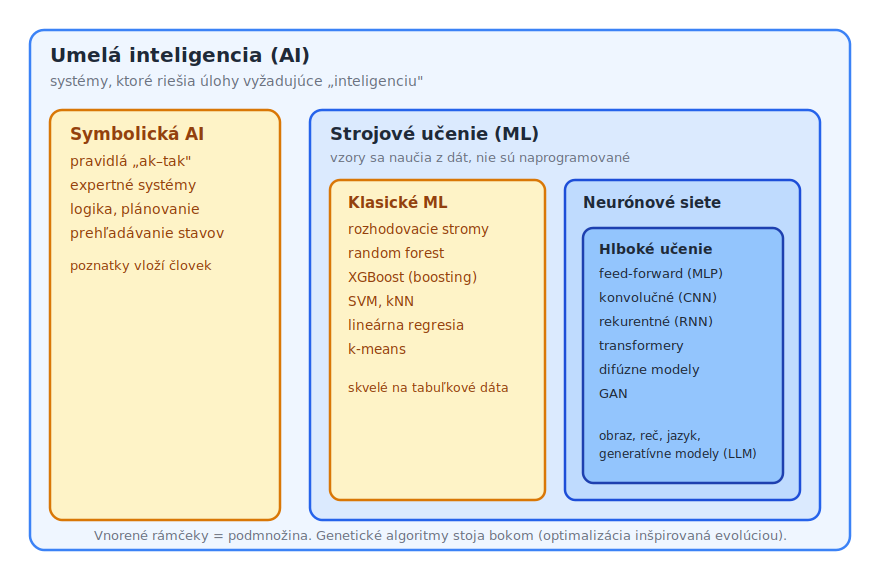
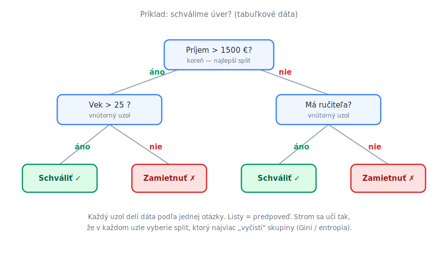
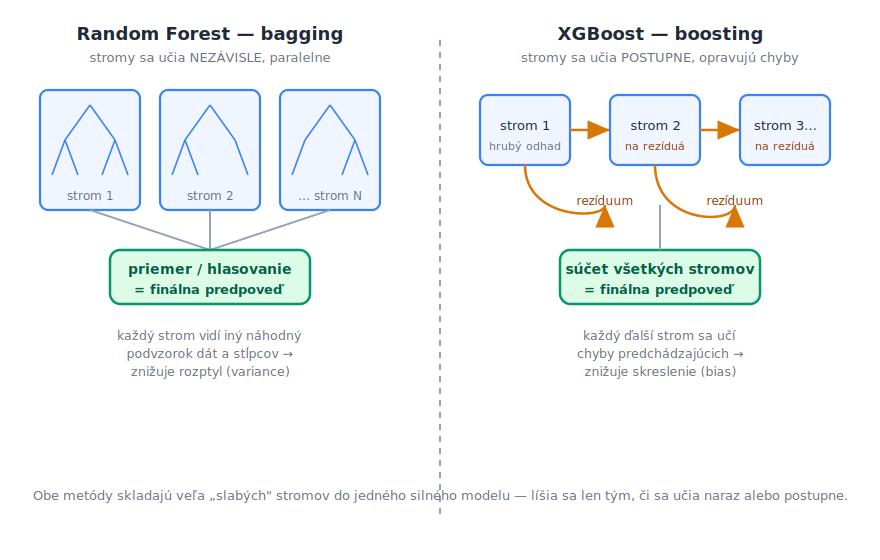
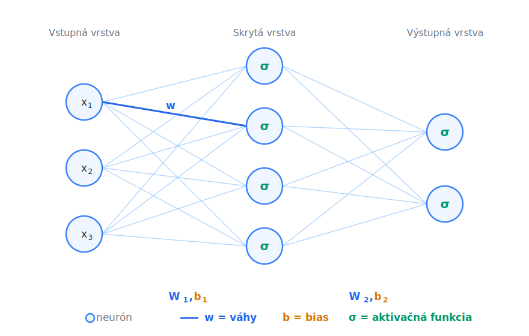
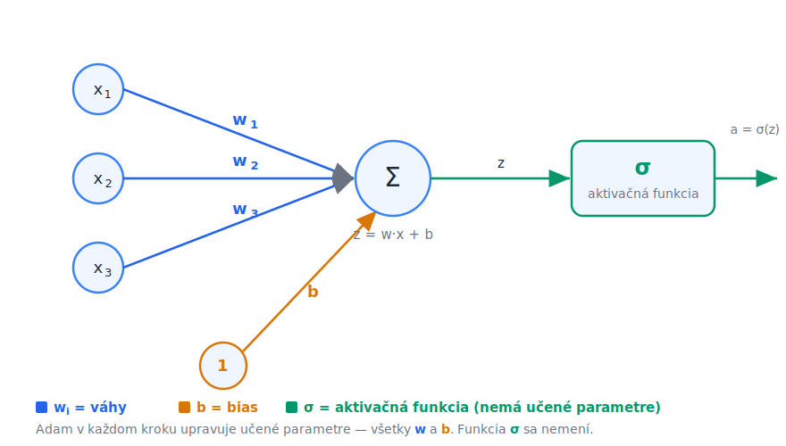
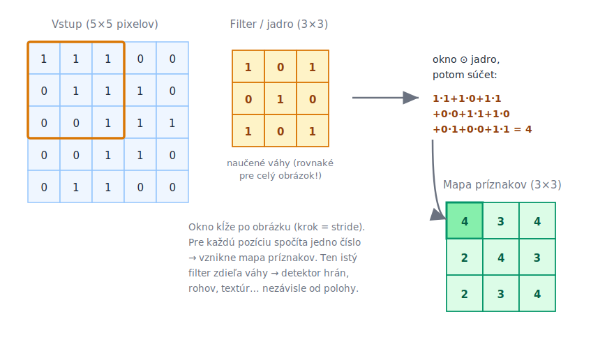
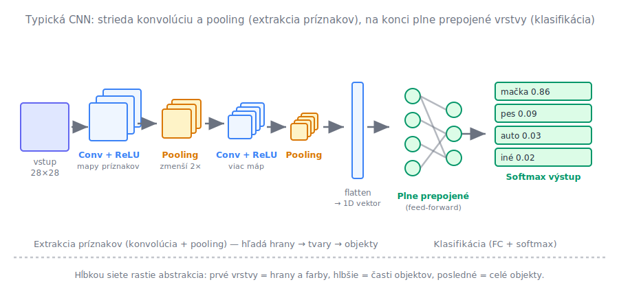
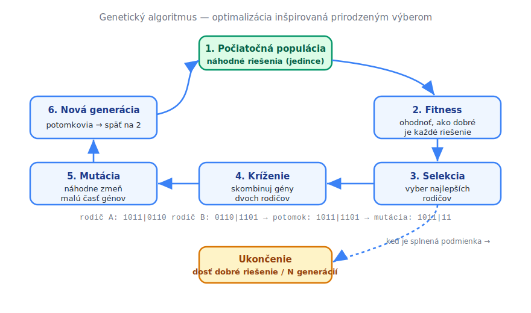

# Umelá inteligencia — prehľad prístupov a modelov

> **Cieľ dokumentu:** dať ucelený, ale prakticky ladený prehľad toho, čo je umelá inteligencia, ako sa delí, a aké hlavné rodiny modelov sa dnes používajú — od rozhodovacích stromov a XGBoostu cez feed-forward a konvolučné neurónové siete až po genetické algoritmy. Ku každému modelu je obrázok, typické použitie (tabuľkové dáta, spracovanie obrazu…) a stručné výhody/nevýhody.

Transformery a mechanizmus attention majú vlastný, detailnejší dokument: [transformer-siete.md](transformer-siete.md).

---

## Čo je umelá inteligencia

**Umelá inteligencia (AI)** je široký pojem pre systémy, ktoré riešia úlohy, na aké by sme u človeka povedali, že vyžadujú „inteligenciu": rozpoznať objekt na fotke, preložiť vetu, naplánovať trasu, odporučiť film alebo hrať šach. AI nie je jedna konkrétna technológia — je to skôr **cieľ** (napodobniť rozumné správanie), ku ktorému vedie viacero rôznych ciest.

Historicky sa vyvinuli dva veľké prúdy:

1. **Symbolická AI** (staršia, „Good Old-Fashioned AI"). Znalosti a pravidlá do systému **vloží človek** vo forme explicitných pravidiel typu „ak–tak", logických výrokov, rozhodovacích tabuliek alebo prehľadávania stavového priestoru. Príklady: expertné systémy pre diagnostiku, šachové enginy so stromom ťahov, plánovače, pravidlové chatboty. Výhoda: je to **vysvetliteľné** a predvídateľné. Nevýhoda: pravidiel je pri reálnych problémoch priveľa a niektoré veci (napr. „čo je na obrázku mačka") sa pravidlami napísať prakticky nedajú.

2. **Strojové učenie (Machine Learning, ML)** (dominantné dnes). Systém sa **naučí vzory priamo z dát**, namiesto toho, aby mu ich niekto naprogramoval. Ukážeme mu tisíce príkladov a on si sám nastaví vnútorné parametre tak, aby dobre predpovedal. Sem patria stromy, XGBoost aj celé hlboké učenie.

### Taxonómia — ako do seba veci zapadajú



Kľúčové je pochopiť **vzťah vnorenia**: hlboké učenie je podmnožinou neurónových sietí, tie sú podmnožinou strojového učenia a to je podmnožinou AI. Bežná chyba je používať „AI" a „neurónové siete" ako synonymá — v skutočnosti je neurónová sieť len jeden (dnes veľmi úspešný) nástroj vo veľkej škatuli AI. **Hlboké učenie (deep learning)** pritom nie je samostatná technológia, ale jednoducho neurónové siete s väčším počtom vrstiev; hranica nie je ostrá, no zhruba od dvoch-troch skrytých vrstiev hovoríme o hlbokej sieti. Pojem sa ujal preto, že práve hĺbka — a s ňou schopnosť učiť sa hierarchiu príznakov — stála za prelomovými výsledkami v rozpoznávaní obrazu a reči po roku 2012.

Kde v tejto mape ležia modely z tohto dokumentu:

- **Rozhodovacie stromy, random forest a XGBoost** patria do strojového učenia, ale nie sú to neurónové siete. Hovorí sa im aj „klasické" metódy ML — a ako uvidíme, na tabuľkových dátach klasické neznamená horšie.
- **Feed-forward siete (MLP) a konvolučné siete (CNN)** sú neurónové siete; ak majú veľa vrstiev, spadajú do hlbokého učenia.
- **Genetické algoritmy** stoja trochu bokom: nie sú to klasifikátory ani siete, ale **optimalizačná metóda** inšpirovaná evolúciou. Patria do AI (do rodiny evolučných výpočtov), ale nie do strojového učenia v užšom zmysle — nemajú trénovacie dáta, z ktorých by sa učili vzory; hľadajú čo najlepšie riešenie zadaného problému. Dajú sa však použiť aj na ladenie iných modelov, preto ich v prehľade uvádzame samostatne na konci.

---

## Strojové učenie — tri základné režimy

Podľa toho, aké dáta máme k dispozícii a čo od modelu chceme, rozlišujeme tri hlavné režimy učenia:

| Režim | Čo máme | Čo sa učí | Typický príklad |
|---|---|---|---|
| **Učenie s učiteľom** (*supervised*) | vstupy **aj správne odpovede** (labely) | mapovanie vstup → výstup | „táto fotka = mačka", predikcia ceny bytu |
| **Učenie bez učiteľa** (*unsupervised*) | len vstupy, **bez labelov** | štruktúra, zhluky, podobnosti | segmentácia zákazníkov, [embeddingy](embeddings.md) |
| **Posilňované učenie** (*reinforcement*) | prostredie + **odmena** za akcie | stratégia (politika) maximalizujúca odmenu | hra Go, riadenie robota, [demo s tankom](../demo/Readme.md) |

Väčšina modelov v tomto dokumente (stromy, XGBoost, klasifikačné siete) sú príklady **učenia s učiteľom**. Spoločná schéma je vždy rovnaká:

```text
  trénovacie dáta ──►  MODEL  ──► predpoveď
                         ▲            │
                         │            ▼
                    úprava parametrov ◄── porovnaj s pravdou (loss)
```

Model urobí predpoveď, porovná ju so správnou odpoveďou (chyba = *loss*), a upraví svoje parametre tak, aby chyba klesala. Toto sa opakuje na tisícoch príkladov. Detailne je tréningová slučka a optimalizátor rozpísaný v [adam-optimalizator.md](adam-optimalizator.md).

Ešte jedno praktické rozdelenie dát, ktoré sa ťahá celým ML:

- **Tabuľkové dáta** — riadky a stĺpce (Excel, databáza): vek, príjem, počet klikov… Tu dnes **kraľujú stromové metódy a XGBoost**.
- **Neštruktúrované dáta** — obraz, zvuk, text, video. Tu **kraľuje hlboké učenie** (CNN pre obraz, transformery pre text).

Toto rozlíšenie je najdôležitejšia intuícia pri výbere modelu, preto sa k nemu budeme vracať pri každej rodine.

### Zovšeobecnenie a preučenie

Cieľom učenia nie je, aby model bezchybne zvládol trénovacie príklady — ich správne odpovede predsa už poznáme. Cieľom je **zovšeobecnenie (generalizácia)**: správne predpovedať aj na dátach, ktoré model počas tréningu nikdy nevidel. Preto sa dostupné dáta pred trénovaním rozdelia: väčšina (typicky okolo 80 %) tvorí **trénovaciu množinu**, na ktorej sa model učí, a zvyšok sa odloží bokom ako **testovacia množina**, na ktorej sa až na záver zmeria, ako model obstojí na neznámych príkladoch. Chyba na testovacej množine je jediný poctivý odhad kvality modelu — chyba na trénovacej množine sa dá „vylepšiť" obyčajným memorovaním.

Pri učení hrozia dva opačné neduhy:

- **Preučenie (overfitting):** model je príliš pružný a naučí sa trénovacie dáta doslova naspamäť — vrátane náhodného šumu a výnimiek, ktoré sa už nikdy nezopakujú. Poznávacie znamenie: na trénovacej množine takmer nulová chyba, na testovacej výrazne horšia. Model si nezapamätal vzor, ale konkrétne príklady.
- **Nedoučenie (underfitting):** model je naopak príliš jednoduchý na to, aby vzor v dátach vôbec zachytil — chybuje na trénovacej aj testovacej množine. Typický obraz: zjavne zakrivený vzťah sa snažíme preložiť priamkou.

S tým súvisí užitočný rozklad chyby na dve zložky, ktorý budeme potrebovať pri ansámbloch stromov:

- **Skreslenie (bias)** je systematická chyba príliš jednoduchého modelu. Nech ho trénujeme na akejkoľvek vzorke, na skutočný vzor jednoducho „nedosiahne" — vždy sa mýli podobným smerom.
- **Rozptyl (variance)** je nestálosť príliš pružného modelu. Na každej trénovacej vzorke sa naučí niečo trochu iné; jeho predpovede „lietajú" podľa toho, aké dáta náhodou dostal.

Jednoduché modely mávajú vysoké skreslenie a nízky rozptyl, zložité modely naopak. Umenie strojového učenia spočíva v hľadaní rovnováhy medzi nimi — alebo, ako uvidíme pri random foreste a boostingu, v šikovnom zložení viacerých modelov tak, aby sa jedna zo zložiek chyby potlačila.

---

## 1. Rozhodovacie stromy

**Rozhodovací strom** rozdeľuje dáta sériou jednoduchých otázok typu „je príjem väčší ako 1500 €?". Každá otázka rozdelí dáta na dve vetvy; postupným vetvením sa dopracujeme k listu, ktorý obsahuje predpoveď.



**Ako sa učí:** algoritmus v každom uzle vyskúša možné otázky (splity) a vyberie tú, ktorá dáta najlepšie „vyčistí" — teda po rozdelení sú skupiny čo najviac homogénne (jedna vetva prevažne „schváliť", druhá prevažne „zamietnuť"). Miera nečistoty sa meria napr. **Gini indexom** alebo **entropiou**. Obe miery hovoria to isté iným jazykom: uzol, v ktorom sú všetky príklady jednej triedy, má nečistotu nulovú; uzol rozdelený presne pol na pol má nečistotu najvyššiu možnú. Algoritmus vždy siahne po splite, ktorý nečistotu zníži najviac, a vetvenie pokračuje, kým nie sú listy dostatočne čisté alebo kým sa nedosiahne maximálna hĺbka.

**Prečo sa jeden strom ľahko preučí:** ak strom necháme rásť bez obmedzenia, vetví sa dovtedy, kým v každom liste nezostane hŕstka príkladov — pokojne aj jediný. Taký strom má na trénovacích dátach stopercentnú úspešnosť, lenže posledné vetvenia už nezachytávajú skutočné vzory, iba náhodný šum konkrétnej vzorky („klient č. 4217 nesplatil, hoci všetko nasvedčovalo opaku"). Na nových dátach potom tieto pseudopravidlá škodia. Rast stromu sa preto obmedzuje — maximálnou hĺbkou, minimálnym počtom príkladov v liste alebo dodatočným orezávaním (*pruning*) — vždy je to však kompromis: prísne obmedzený strom zas stráca presnosť. S tým súvisí aj **nestabilita**: keďže sa splity vyberajú pažravo zhora nadol, malá zmena dát môže zmeniť už prvú otázku v koreni a celý zvyšok stromu sa poskladá inak.

**Typické použitie:** tabuľkové dáta — schvaľovanie úverov, medicínska triáž, jednoduché pravidlové rozhodovanie, kde chceme, aby sa výsledok dal ukázať a obhájiť.

| ✅ Výhody | ❌ Nevýhody |
|---|---|
| Veľmi **vysvetliteľné** — cestu k rozhodnutiu vie prečítať aj laik | Jeden strom sa ľahko **preučí** (overfitting) — zapamätá si šum v dátach |
| Netreba škálovať ani normalizovať vstupy | **Nestabilný** — malá zmena dát môže dať úplne iný strom |
| Zvláda číselné aj kategorické atribúty | Sám osebe má **nižšiu presnosť** ako ansámble |
| Rýchle trénovanie aj predikcia | Nevie dobre modelovať plynulé, „šikmé" hranice |

> Práve nestabilita a náchylnosť na preučenie viedli k tomu, že sa jednotlivé stromy skladajú do **ansámblov** — random forest a boosting.

---

## 2. Random Forest a XGBoost (ansámble stromov)

Namiesto jedného stromu sa použije **veľa stromov naraz** a ich predpovede sa skombinujú. Existujú dve hlavné stratégie, ako to spraviť — a je dobré vidieť ich vedľa seba:



### Random Forest (bagging)

Natrénuje sa mnoho stromov (typicky stovky) **nezávisle a paralelne**. Aby neboli všetky rovnaké, vnesie sa do tréningu dvojitá náhoda:

1. každý strom dostane iný **bootstrap výber** dát — náhodnú vzorku trénovacích riadkov s opakovaním,
2. pri každom vetvení smie strom vyberať otázku len z **náhodnej podmnožiny stĺpcov**.

Finálna predpoveď je **priemer** (regresia) alebo **hlasovanie** (klasifikácia). Trik je v tom, že jednotlivé stromy pokojne môžu byť hlboké a preučené — každý sa však preučí na *iný* šum, lebo videl iné dáta a iné stĺpce. Pri spriemerovaní sa tieto náhodné chyby navzájom vyrušia a zostane to, na čom sa stromy zhodujú: skutočný vzor. Je to rovnaký princíp, ako keď priemer mnohých nepresných meraní dá oveľa presnejší odhad než ktorékoľvek jedno meranie. Random forest teda **znižuje rozptyl (variance)**, pričom skreslenie nechá zhruba tam, kde ho mal jednotlivý strom.

### XGBoost (gradient boosting)

**Boosting** ide na to opačne: stromy sa učia **postupne**, jeden po druhom, a každý sa sústredí na to, čo predchádzajúce pokazili. Malý príklad s odhadom ceny bytu, ktorého skutočná cena je 120 000 €: prvý strom odhadne 100 000 €, chyba (**rezíduum**) je teda +20 000 €. Druhý strom sa už neučí predpovedať cenu, ale toto rezíduum — odhadne povedzme +15 000 €. Priebežný súčet 115 000 € je bližšie k pravde a tretí strom opravuje zvyšných 5 000 €. Finálna predpoveď je **súčet** príspevkov všetkých stromov.

Na rozdiel od random forestu sa používajú **plytké stromy** (bežne hĺbka 3 až 6) — každý je sám osebe slabý model, ale stovky drobných opráv za sebou poskladajú veľmi presný celok. Boosting tak **znižuje skreslenie (bias)** a spravidla dosahuje vyššiu presnosť než bagging. Aby sa pri toľkých krokoch nezačal učiť šum, pripočítava sa každá oprava len čiastočne, prenásobená malým koeficientom (**learning rate**, napr. 0,1), a trénovanie sa zastaví, keď chyba na odloženej validačnej množine prestane klesať.

Kontrast sa oplatí zapamätať: **bagging skladá silné (hlboké) stromy paralelne a tlmí rozptyl; boosting skladá slabé (plytké) stromy sekvenčne a tlmí skreslenie.**

**XGBoost** (*eXtreme Gradient Boosting*) je najznámejšia, vysoko optimalizovaná implementácia gradient boostingu. Pridáva regularizáciu, prácu s chýbajúcimi hodnotami a efektívne paralelné budovanie stromov. Spolu s príbuznými (LightGBM, CatBoost) je to **dlhodobo najúspešnejší model na tabuľkové dáta** a takmer štandardný víťaz Kaggle súťaží mimo obrazu a textu.

Prečo na tabuľkách vyhrávajú stromy nad neurónovými sieťami? Tabuľkové stĺpce sú rôznorodé (eurá, roky, kategórie) a nemajú priestorovú ani sekvenčnú štruktúru, ktorú by sieť vedela využiť; riadkov bývajú tisíce až státisíce, nie milióny; a stromom neprekážajú rôzne škály ani chýbajúce hodnoty. Neurónová sieť tu nemá čo „objaviť" navyše — a zaplatíte za ňu dlhším trénovaním, náročnejším ladením a horšou vysvetliteľnosťou.

**Typické použitie:** predikcia na tabuľkových dátach — riziko úveru, predikcia dopytu/predaja, detekcia podvodov, ranking, scoring zákazníkov. Tam, kde máte stĺpce a riadky, začnite XGBoostom.

| ✅ Výhody | ❌ Nevýhody |
|---|---|
| **Špičková presnosť na tabuľkových dátach**, často lepšia než neurónky | Viac **hyperparametrov** na ladenie (počet stromov, hĺbka, learning rate) |
| Robustný, zvláda chýbajúce hodnoty a rôzne škály | Menej vysvetliteľný než jeden strom (ale existuje SHAP) |
| Random forest sa ťažko preučí a beží paralelne | Boosting je **sekvenčný** → pomalšie trénovanie na obrích dátach |
| Netreba veľa dát ani GPU | **Nehodí sa** na obraz/zvuk/text (surové pixely či slová) |

---

## 3. Feed-forward neurónové siete (MLP)

**Feed-forward neurónová sieť** (viacvrstvový perceptrón, *MLP*) je najzákladnejší typ neurónovej siete. Skladá sa z vrstiev neurónov; informácia tečie **jedným smerom** — od vstupu cez skryté vrstvy k výstupu, bez cyklov.



Každý neurón spočíta vážený súčet svojich vstupov, pripočíta **bias** a prevedie výsledok cez nelineárnu **aktivačnú funkciu** (ReLU, sigmoid…):



### Prečo sú nelineárne aktivácie nevyhnutné

Predstavme si na chvíľu sieť **bez** aktivačných funkcií — každá vrstva by počítala len vážený súčet, teda lineárne zobrazenie y = W·x + b. Čo spraví druhá vrstva s výstupom prvej?

```text
  y = W₂ · (W₁ · x + b₁) + b₂  =  (W₂ · W₁) · x + (W₂ · b₁ + b₂)
```

Výsledok je opäť len vážený súčet pôvodných vstupov — s inou maticou váh a iným biasom. Inak povedané: **zloženie ľubovoľného počtu lineárnych vrstiev je stále jedna lineárna vrstva.** Sieť so sto vrstvami by nedokázala nič viac než obyčajná lineárna regresia — nevedela by oddeliť ani body, ktoré sa nedajú rozdeliť priamkou (klasický príklad je funkcia XOR). Pridávanie ďalších vrstiev by nepomohlo vôbec, len by pribúdali parametre.

Nelineárna aktivácia vložená medzi vrstvy toto „zrútenie" zlomí. Najpoužívanejšia **ReLU** je pritom prekvapivo jednoduchá: záporné hodnoty vynuluje, kladné nechá tak — max(0, z). **Sigmoid** stláča výstup do intervalu (0, 1), preto sa hodí na výstupnú vrstvu, keď má výstup vyjadrovať pravdepodobnosť. Vďaka nelinearite môže každá ďalšia vrstva rozhodovaciu hranicu „ohýbať" — a platí **veta o univerzálnej aproximácii**: už sieť s jednou dostatočne širokou nelineárnou skrytou vrstvou dokáže aproximovať ľubovoľnú spojitú funkciu. V praxi sa namiesto jednej obrovskej vrstvy používa viac menších — hlbšia sieť sa tú istú vec spravidla naučí s menším počtom neurónov.

Ako sa váhy a biasy ladia tréningom (forward pass → loss → backpropagation → update optimalizátorom Adam), podrobne rozoberá [adam-optimalizator.md](adam-optimalizator.md).

**Typické použitie:** univerzálny „lepiaci" model — klasifikácia a regresia na stredne veľkých dátach, koncové vrstvy v zložitejších sieťach (napr. klasifikačná hlava CNN alebo transformera), aproximácia funkcií v simuláciách.

| ✅ Výhody | ❌ Nevýhody |
|---|---|
| **Univerzálny aproximátor** — teoreticky zvládne ľubovoľný vzťah | Ignoruje štruktúru dát (pri obraze nevie, že susedné pixely spolu súvisia) |
| Základný stavebný blok všetkých hlbokých sietí | Veľa parametrov → **potrebuje veľa dát**, ľahko sa preučí |
| Zvláda nelineárne vzťahy, ktoré strom ťažko | Na tabuľkových dátach ho **XGBoost často predbehne** |
| Beží dobre na GPU | Menej vysvetliteľný — „čierna skrinka" |

---

## 4. Konvolučné neurónové siete (CNN)

**Konvolučná sieť (CNN)** je navrhnutá pre dáta s **priestorovou štruktúrou** — predovšetkým obrázky. Kľúčová myšlienka: namiesto toho, aby každý neurón videl všetky pixely (ako v MLP), použije malý **filter (jadro)**, ktorý kĺže po obrázku a hľadá lokálny vzor — hranu, roh, textúru.



Ten istý filter má **rovnaké váhy pre celý obrázok** (*weight sharing*), takže detektor hrany funguje rovnako v ľavom hornom aj pravom dolnom rohu. To dramaticky znižuje počet parametrov a dáva sieti **invarianciu voči posunu** — mačka je mačka, nech je kdekoľvek v zábere.

Rozdiel oproti MLP vidno na číslach. Obrázok 200 × 200 pixelov v odtieňoch sivej má 40 000 vstupov. Keby sme naň pustili plne prepojenú vrstvu s 1 000 neurónmi, potrebovala by 40 000 × 1 000 = **40 miliónov váh** — a čo je horšie, každý vzor by sa naučila len pre presnú polohu, v ktorej sa v tréningových dátach vyskytol. Konvolučná vrstva s 32 filtrami veľkosti 3 × 3 si vystačí s 32 × (9 + 1) = **320 parametrami**, pretože tých deväť váh každého filtra sa opakovane použije na každú pozíciu obrázka. Dve kľúčové slová, ktoré za tým stoja: **lokálnosť** (neurón sa pozerá len na malé okienko, nie na celý obraz) a **weight sharing** (to isté okienko váh sa použije všade).

Celá sieť potom **strieda konvolúciu a pooling** (zmenšovanie), čím postupne extrahuje čoraz abstraktnejšie príznaky, a na konci pripojí feed-forward vrstvy na samotné rozhodnutie:



**Pooling** (najčastejšie *max pooling* 2 × 2) rozdelí mapu príznakov na okienka 2 × 2 a z každého ponechá len najväčšiu hodnotu. Mapa sa tým zmenší na polovicu v oboch rozmeroch, klesne objem ďalších výpočtov a sieť získa ďalšiu dávku odolnosti: ak sa detegovaná hrana posunie o pixel, maximum v okienku sa väčšinou nezmení.

Hĺbkou siete rastie abstrakcia: prvé vrstvy detegujú hrany a farby, stredné časti objektov (oko, koleso), posledné celé objekty.

**Typické použitie:** **spracovanie obrazu** — klasifikácia a detekcia objektov, segmentácia, rozpoznávanie tvárí, analýza medicínskych snímok, OCR; funguje aj na spektrogramy zvuku a iné mriežkové dáta. Praktická úloha v tomto repozitári: [rozpoznávanie obrázkov](zadania/rozpoznavanie-obrazkov.md).

| ✅ Výhody | ❌ Nevýhody |
|---|---|
| **Špička na obraz** a priestorové dáta | Vyžaduje **veľa dát a výpočtu** (GPU) |
| Weight sharing → menej parametrov, invariancia voči posunu | Málo vysvetliteľná — ťažko sa zisťuje „prečo" |
| Automaticky sa naučí príznaky (netreba ich ručne navrhovať) | Citlivá na adversariálne zmeny (malý šum ju zmätie) |
| Hierarchia hrany → tvary → objekty | Na **tabuľkových dátach zbytočná** — použite XGBoost |

> Pre postupnosti (text, časové rady) CNN nestačí — tam sa dnes používajú **transformery**, ktorým sa venuje [samostatný dokument](transformer-siete.md).

---

## 5. Genetické algoritmy

**Genetický algoritmus (GA)** nie je klasifikátor — je to **optimalizačná metóda** inšpirovaná prirodzeným výberom. Používa sa tam, kde hľadáme dobré riešenie v obrovskom priestore možností a nemáme (alebo nechceme počítať) gradient — napr. návrh rozvrhu, trasy, tvaru súčiastky, alebo ladenie hyperparametrov iného modelu.



Riešenie sa zakóduje ako **„chromozóm"** (napr. reťazec bitov alebo čísel). Algoritmus udržiava celú **populáciu** riešení a opakuje evolučný cyklus:

1. **Fitness** — ohodnotí, aké dobré je každé riešenie.
2. **Selekcia** — vyberie najlepšie jedince ako rodičov.
3. **Kríženie (crossover)** — skombinuje gény dvoch rodičov do potomka.
4. **Mutácia** — náhodne zmení malú časť génov (udržuje rozmanitosť, bráni uviaznutiu).
5. Vznikne **nová generácia** a cyklus sa opakuje, kým nie je riešenie dosť dobré alebo neuplynie daný počet generácií.

**Konkrétny príklad — školský rozvrh.** Chromozóm je zoznam priradení (trieda, predmet, učiteľ, miestnosť, hodina). Fitness funkcia sčíta pokuty: povedzme −10 za každý konflikt (učiteľ na dvoch miestach naraz, dve triedy v jednej miestnosti) a −1 za každé „okno" v rozvrhu triedy. Gradient tu nemá zmysel — rozvrh sa nedá „derivovať podľa učiteľa" a drobná zmena (prehodenie dvoch hodín) môže skokovo zmeniť počet konfliktov. Ohodnotiť hotový rozvrh je však triviálne, a presne to genetickému algoritmu stačí: kríženie skombinuje dopoludnie jedného dobrého rozvrhu s popoludním iného, mutácia občas prehodí dve hodiny a po stovkách generácií vypadne rozvrh bez konfliktov.

Odtiaľ vidno aj deliacu čiaru voči gradientným metódam. **Ak vieme spočítať gradient** — ako pri neurónových sieťach, kde je loss hladká funkcia váh — je gradientný zostup rádovo rýchlejší a genetický algoritmus by bol plytvaním. **Ak gradient neexistuje alebo nedáva zmysel** — diskrétne a kombinatorické problémy, nespojité funkcie, simulácie typu „čierna skrinka", kde vieme riešenie len ohodnotiť — býva evolučný prístup najjednoduchšou schodnou cestou.

**Typické použitie:** kombinatorická optimalizácia (rozvrhy, logistika, packing), návrh a ladenie (architektúry sietí, hyperparametre), evolučné umenie, hry a agenti bez explicitného gradientu.

| ✅ Výhody | ❌ Nevýhody |
|---|---|
| Nepotrebuje gradient ani spojitú funkciu | **Výpočtovo drahé** — veľa vyhodnotení fitness |
| Zvláda členité, nespojité priestory s mnohými lokálnymi optimami | Nezaručuje nájdenie globálneho optima |
| Ľahko sa paralelizuje a prispôsobí problému | Citlivé na nastavenie (veľkosť populácie, miera mutácie) |
| Univerzálne — stačí vedieť ohodnotiť riešenie | Pri problémoch, kde *je* gradient, býva pomalšie než gradientné metódy |

---

## Zhrnutie — ktorý model kedy

| Dáta / úloha | Odporúčaný prvý model | Prečo |
|---|---|---|
| **Tabuľkové dáta** (riadky × stĺpce) | **XGBoost** / random forest | najvyššia presnosť, málo dát, netreba GPU |
| Potrebujem **vysvetliteľnosť** | rozhodovací strom (+ SHAP na XGBoost) | čitateľná cesta k rozhodnutiu |
| **Obraz** (klasifikácia, detekcia) | **CNN** | weight sharing, hierarchia príznakov |
| **Text / postupnosti / jazyk** | **transformer** → [transformer-siete.md](transformer-siete.md) | attention, kontext, dnešné LLM |
| Univerzálny nelineárny vzťah, koncová hlava | **feed-forward (MLP)** | jednoduchý, univerzálny aproximátor |
| **Optimalizácia bez gradientu** | **genetický algoritmus** | členité priestory, kombinatorika |

**Najdôležitejšie pravidlo:** typ dát určuje model viac než čokoľvek iné. Na tabuľky nasadzujte stromy/XGBoost, na obraz CNN, na text transformery — a neurónovú sieť neťahajte tam, kde jednoduchší model spraví rovnakú prácu lacnejšie a vysvetliteľnejšie.

---

## Kontrolné otázky

Ak viete odpovedať vlastnými slovami, dokument ste pochopili:

1. Vysvetlite vzťah vnorenia AI ⊃ ML ⊃ neurónové siete ⊃ deep learning. Kam patrí XGBoost a kam genetický algoritmus?
2. Prečo sa jeden rozhodovací strom ľahko preučí (overfitting) a ako presne tento problém riešia Random Forest a boosting — každý inou cestou?
3. Banka rieši predikciu nesplácania úverov z tabuľky s 50 stĺpcami. Kolega navrhuje hlbokú neurónovú sieť. Aký model navrhnete vy a ako to obhájite?
4. Čo by sa stalo, keby mala MLP sieť len lineárne aktivácie (žiadne ReLU/sigmoid)? Prečo by potom nepomáhalo pridávať vrstvy?
5. Prečo CNN potrebuje rádovo menej parametrov než MLP na ten istý obrázok? (Kľúčové slová: weight sharing, lokálnosť.)
6. Kedy siahnete po genetickom algoritme namiesto gradientnej optimalizácie? Uveďte konkrétny príklad úlohy.

---

### Súvisiace dokumenty v repozitári

- [prehlad-predmetu.md](prehlad-predmetu.md) — **prehľad celého predmetu (8 lekcií)** — začnite tu

- [transformer-siete.md](transformer-siete.md) — detailné vysvetlenie transformerov a attention (s obrázkami)
- [adam-optimalizator.md](adam-optimalizator.md) — ako sa neurónové siete trénujú (backpropagation, Adam)
- [embeddings.md](embeddings.md) — ako sa z textu stane vektor (embeddingy, RAG)
- [llm-trendy.md](llm-trendy.md) — aktuálne trendy vo veľkých jazykových modeloch
- [zadania/rozpoznavanie-obrazkov.md](zadania/rozpoznavanie-obrazkov.md), [zadania/RAG_Fine_tunning.md](zadania/RAG_Fine_tunning.md) — praktické úlohy
